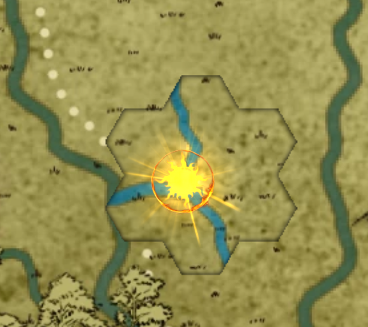

# The Fall

## Location

### **Starting Town**

## Preamble

1. Barbarian, Champion and Sorcerer will be receiving updates in August, so we will need to take a look at making adjustments to them at that time.
1. **Jason** - Sorcerer things to keep in mind. Whenever you cast a focus spell or use a spell that is granted to you by your bloodline, You get your blood magic effect automatically applied, which at the moment is a +1 to AC for round.
1. XP Rewards - I am going to be bum rushing you guys to level 5. I will be giving you accelerated xp for the first 5 levels. After that you will be gaining xp at the regular rate.
    1. double xp
    2. 1.75 xp
    3. 1.5 xp
    4. 1.25 xp
1. I will be asking for feedback after the end of every session to help me improve the game. Something that brings me joy is doing a good job, and I would ask that you take a few minutes after each session to answer a few questions. I want to be constantly improving.
    - Rate the session from 1-5
    - What was your favorite thing about the last session?
    - What was your least favorite thing about the last session?
    - Did I lose you at any point?
    - How can the game get better?

## Intro

- You find yourself in the town square. Did you have anything that you were specifically doing that where planning on doing? How come you have your weapons on your person?

## Strong Start

- All the sudden the ground underneath you erupts as a sink hole appears right underneath your feet.
- You fall 50 feet down knocking against rocks and ridges, Miraculously landing unscathed on a stone bridge covered in Sand and debris.
- taking in your surroundings you see:
  - an ancient temple on one side of the bridge
  - you are surrounded by a number Dead or dieing Goblins.
  - There are scorch marks lining the walls and the ceiling of the cavern.
- Some of the Goblins you took for dead get stand up armed for battle.
- You also notice that a what looks to be a human corpse stands up shambles towards you, while what you took for a pile of bones assembles it's self into a skeleton.
- They all Charge you. Roll initiative.
