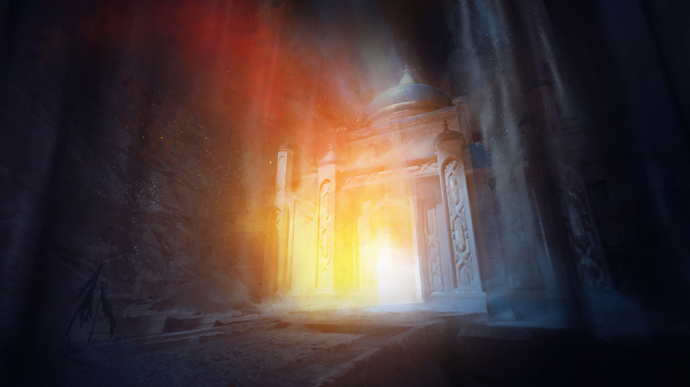

git# The Fall

## Location

### **Starting Location**

## Preamble

1. Video chat options?
3. Barbarian, Champion and Sorcerer will be receiving updates in August, so we will need to take a look at making adjustments to them at that time.
4. **Jason** 
   - Sorcerer things to keep in mind. Whenever you cast a focus spell or use a spell that is granted to you by your bloodline, You get your blood magic effect automatically applied, which at the moment is a +1 to AC for round.
   - When Player Core 2 comes out, there is a dragon versatile heritage that you can use, so instead of having the Human base with the Elf versatile heritage, you could have an elf base with a dragon versatile heritage which fits better with your back story.
4. Variant Rules we will be playing with.
	1. Free Archtype
	2.  Automatic Bonus Progression (Skill potency must be managed manually)
5. XP Rewards - I am going to be bum rushing you guys to level 5. I will be giving you accelerated xp for the first 5 levels, giving you less hp per fight every level gained. After you reach level 5 you will be gaining xp at the regular rate.
6. I also am going to be running the VTT a little different. Less like a Video game and more like a Classical RPG.
7. I will be asking for feedback after the end of every session to help me improve the game. Something that brings me joy is growing in my skills and doing a good job and I would ask that you take a few minutes after each session to answer a few questions to help me get better. You aren't doing me any favors, if I am doing something that is off putting or frustrating to you and you don't tell me. I want to be constantly improving.
    - Rate the session from 1-5
    - What was your favorite thing about the last session?
    - What was your least favorite thing about the last session?
    - Did I lose you at any point?
    - How can the game get better?
 
# Intro

## Characters
### Alwor - Ramsey
Gnome Entertainer who is friendly and cares about the community, Always checking in on everyone in the aftermath of the Flaming Retrobution
### Cahir - Scott
Dromaar Protector. Works with the community to make sure that it is protected and kept safe. Works pretty heavily with the Solaris Sentinels
### Karsten - Clark
Member of the Solaris Sentinels that works as a protector of the community.
### Simear - Jason
Crafter and tinkerer in the community.

- Each of you find yourself in the Town Square around 1 in the afternoon for your own reasons.

## Strong Start
### Sink Hole in the Market!!
- All the sudden the ground underneath you erupts as a sink hole appears right underneath your feet.
- While your constant grabbing at the edge of rocks and crevasses doesn't prevent you from falling down the hole you are able to catch yourself enough to not take any damage from the fall, landing unscathed on a stone bridge covered in Sand and debris.

# Surroundings:
  - In front of you. You see a temple.
  - you are surrounded by many Dead Goblins
  - There are scorch marks lining the walls and the ceiling of the cavern.
  - You land on a bridge that sits on what looks to be a lake of sand.
  - Behind you you see a sealed cave enterence

# FIGHT!!
- Some of the Goblins you took for dead get stand up, shake themselves off with weapons drawn. One of them says, "More!? How many long-shanks we got to kill in this place!?"
- You also notice too the north, shambling your way, a human corpse. Close at hand an armed Skeleton lurches towards you.
- **Roll initiative.**

## Enter the Dungeon

### Points of interest outside of the temple

- ***Simple checks***
    - The sand is continually falling, but it doesn't appear to be accumulating
    - you hear more commotion inside the temple to your north.
    - you hear the sound of small feet running away in the tunnel to your south.
    - The hole that you fell through is 60 feet up and people are starting to gather around the edge to see what the commotion is about.
- ***Moderate check***
    - [**Religeon**] There are no obvious signs of iconography to give away who this is a temple to.
        - This could mean that this is a temple to an ancient power that you have not heard of.
    - [**Occultism**] This Temple was not built underground. it was built on the surface, but there is not a single stone that is out a place. It is kind of like it was picked up and set here by some great force
    - [**Arcana**] The sand appears to have a teleportation spell at the bottom that seems to be causing the sandfall. You have seen something similar before, not to this scale, in a sand timer. You are getting wifs of powerful teleportation magic even beyond that. The very air hums with it.
    - [**Nature**] The Sandiness of the soil here doesn't match the geographic area that you are in.
    - [**Society**] There are no records of any stand along temples that existed near this location in the old world. Given the architecture and the age of the temple you would expect there to have been some sort of record.
    - [**Survival**] When the town was being surveyed and the buildings were being built, you are certain that there was not a hollowed of this size that was so close to the surface.
- ***Difficult***
    - This appears to be the temple of [Shananooah](../../../World/Religion/Shananooah.md) Goddess of Time...

# Secrets

1. The name of the temple ***Aurorae Temporis et Spatii***
2. This temple was built in the far south in the Dessert, but it never seems to stay in the same place for very long. It has been known throughout history to appear in places all over Aetheria. It is considered to be a Harbinger of the increase of Darkness and Light.
	- It appears in places for inconsistent amounts of time. Sometimes hours, sometimes decades.
	- **Rumor:** There is an artifact in the temple that can affect the flow of time. Should someone get a hold of it, then they could 
3. **The Goblins** are looking for an artifact that is unique to this temple that is ***rumored to be able to Turn back time.***
4. The Goblins are being provoked into action or controlled.
5. The Artifact (A Giant Time turner) is Broken and cannot be repaired by normal means. 
6. Why would someone who is controling Goblins want to turn back time?
7. 