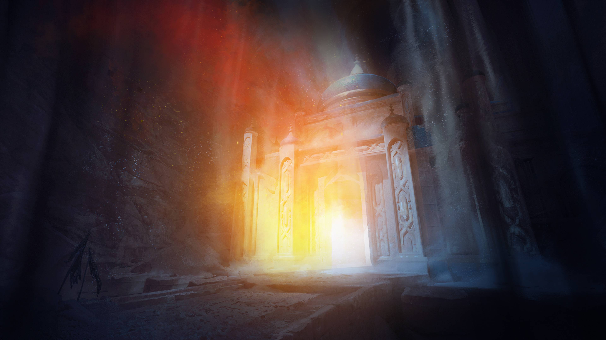

# Into the Temple

## Location: Temple of Shananooah

### **Starting Location**

# Preamble
* Video Chat
* Don't forget your Hero points!!

 
# Review the characters.
## [Alwor](../../PCs/Alwor-Thistlegift.md) - Ramsey
Gnome Entertainer who is friendly and cares about the community, Always checking in on everyone in the aftermath of the Flaming Retribution
## [Cahir](../../PCs/Cahir-Emersyn.md) - Scott
Dromaar Protector. Works with the community to make sure that it is protected and kept safe. Works pretty heavily with the Solaris Sentinels
## [Karsten](../../PCs/Karsten-Kendrick.md) - Clark
Member of the Solaris Sentinels that works as a protector of the community.
## [Simear](../../PCs/Simear.md) - Jason
Crafter and tinkerer in the community.

# Create a strong start.
## Scene Description:

## Enter the Dungeon

### Points of interest outside of the temple
- The sand is continually falling, but it doesn't appear to be accumulating
- you hear more commotion inside the temple to your north.
- you hear the sound of small feet running away in the tunnel to your south.
- The hole that you fell through is 60 feet up and people are starting to gather around the edge to see what the commotion is about.

# Outline potential scenes.

# Define secrets and clues.

1. The name of the temple ***Aurorae Temporis et Spatii***
2. This temple was built in the far south in the Dessert, but it never seems to stay in the same place for very long. It has been known throughout history to appear in places all over Aetheria. It is considered to be a Harbinger of the increase of Darkness and Light.
	- It appears in places for inconsistent amounts of time. Sometimes hours, sometimes decades.
	- **Rumor:** There is an artifact in the temple that can affect the flow of time. Should someone get a hold of it, then they could 
3. **The Goblins** are looking for an artifact that is unique to this temple that is ***rumored to be able to Turn back time.***
4. The Goblins are being provoked into action or controlled.
5. The Artifact (A Giant Time turner) is Broken and cannot be repaired by normal means. 
6. Why would someone who is controling Goblins want to turn back time?
7. 

# Develop fantastic locations.

# Outline important NPCs.
## [Shananooah](../../../World/Religion/Shananooah.md) -- Goddess of time

# Choose relevant monsters.

# Select magic item rewards.