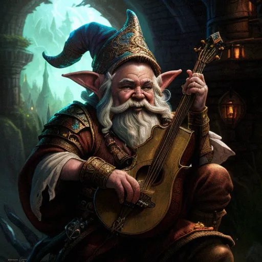

# Alwor

Couldn't quite get it all finished before leaving for vacation, but here's what I've got so far
how old is your character? 386 – OLD even for a gnome
Tell me about your character's family?
Are they still alive? – No, he’s outlived his immediate family, may still have some extended family but doesn’t keep up with them
How does your character feel about their family? – He loved them very much while they were alive and misses them dearly
What did your character do before The Flaming Retribution? Odds and ends, he was a jack of all trades and purposefully found new things to do, learn and experience in order to stave off the Bleaching as long as possible
What does your character currently do for the community? – Currently a source of morale, whether that’s entertaining, or perhaps cooking. He’s one of the communities “dads”
List at least 2 good personality traits – Comforting, and Cheerful, Folksy Wisdom
List at least 1 negative personality trait – Inflexible and Impatient
What is your character’s worldview? (Optimistic, cynical, practical, joyful etc…) Wonderous Awe
What made your character follow the community to the north? – He received a message / visit / dream / vision from an angel / messenger of <Music God> warning him of the disaster
What is a specific goal that your character wants to achieve – He seeks the Llano, a mystical piece of music rumored to be a part of the song of creation. He was taught a small segment of it during his vision which gave him his spellcasting abilities.