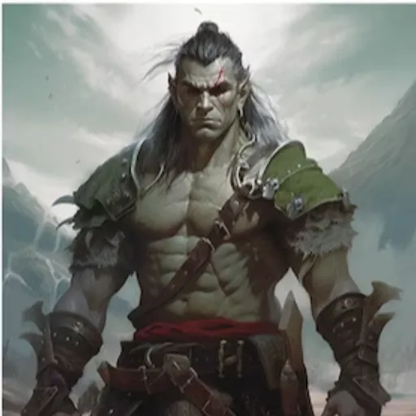

# Cahir Emersyn

## Age
Cahir Emersyn is 37 years old.

## Family
- **Father**: An Orc warrior who died in the [Flaming Retribution](../../World/Events/The-Flaming-Retribution.md) while saving his family.
- **Mother**: A human woman who was the second wife of Cahir's father.
- **Siblings**:
  - **Brother**: [Gald](../../World/Characters/Gald.md), an Orc who has always been Cahir's rival.
  - **Sister**: [Angel](../../World/Characters/Angel.md), a Dromaar.

- **Status**: Cahir's father died in the [Flaming Retribution](../../World/Events/The-Flaming-Retribution.md). Both his brother  [Gald](../../World/Characters/Gald.md) and sister [Angel](../../World/Characters/Angel.md) are alive.
- **Feelings**: Cahir feels a strong sense of loyalty and protection towards his family, despite the rivalry with his brother. He deeply cares for his sister, [Angel](../../World/Characters/Angel.md), who brings out the optimistic side of him.

## Pre-[Flaming Retribution](../../World/Events/The-Flaming-Retribution.md) Life
Before the [Flaming Retribution](../../World/Events/The-Flaming-Retribution.md), Cahir was training as a warrior blacksmith under his father's guidance. He was learning the art of blacksmithing, particularly focusing on creating and repairing weapons, which combined his love for combat and craftsmanship.

## Role in the Community
Cahir currently serves as a blacksmith, specializing in crafting axes. His skills are highly valued in the community, as he provides essential tools and weapons for protection and daily use.

## Personality Traits
- **Positive**:
  - Loyal and protective.
  - Bold and courageous.
- **Negative**:
  - Prone to anger, which can take over his mind and body.

## Worldview
Cahir's worldview has become pessimistic due to the events of the [Flaming Retribution](../../World/Events/The-Flaming-Retribution.md). However, his sister [Angel](../../World/Characters/Angel.md) has a significant influence on him, often helping him see things in a more optimistic light.

## Reason for Moving North
Cahir decided to follow the community north because of his sister, [Angel](../../World/Characters/Angel.md). Her optimism and belief in starting anew inspired him to join the journey for a fresh start.

## Specific Goal
Cahir aims to protect and serve his community, using his skills as a blacksmith and warrior to ensure their safety and well-being.

## Friends/Allies/Enemies/Rivals
- **Friend/Ally**: 
  - **Name**: [Angel](../../World/Characters/Angel.md)
  - **Nature**: Sister
  - **Description**: Kind and loving, she works as a teacher to children in the community.
  - **Role in Community**: Teacher

- **Rival/Enemy**: 
  - **Name**: [Gald](../../World/Characters/Gald.md)
  - **Nature**: Brother (Orc)
  - **Description**: [Gald](../../World/Characters/Gald.md) survived the [Flaming Retribution](../../World/Events/The-Flaming-Retribution.md) but harbors bitterness towards the community, as many of his Orc friends died. He is often provocative and works as a woodsman, mostly on his own.
  - **Role in Community**: Woodsman

- **Friend/Ally**: 
  - **Name**: Balanka
  - **Nature**: Female friend (Dromaar)
  - **Description**: Balanka has always wanted to marry Cahir. She is firm and kind, leading the community’s supply efforts.
  - **Role in Community**: Organizer and leader of supply efforts

## Fear or Phobia
Cahir has a deep fear of losing his sister, [Angel](../../World/Characters/Angel.md). Her safety is his utmost priority.

## Favorite Things
Cahir loves axe throwing, crafting axes, and studying how fire affects metal. These interests not only serve as hobbies but also enhance his skills as a blacksmith.