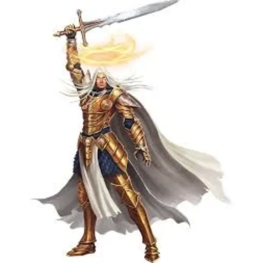

# Karsten

## General Information
- **Class**: Champion
- **Order**: [Order of the Solaris Sentinels](../../World/Factions/Solaris-Sentinels.md)
- **God**: [Raythelion](../../World/Religion/Raythelion.md)
- **Kingdom**: [The Blessed Realm](../../World/Locations/Solaris/Old-World/The-Blessed-Realm/0-The-Blessed-Realm.md)
- **World**: [Aetheria](../../World/Aetheria.md)
- **Continent**: [Solaris](../../World/Locations/Solaris.md)
- **Setting**: Aftermath, one year post-[Flaming Retribution](../../World/Events/The-Flaming-Retribution.md)

## Background

Karsten Kendrick was prophesied to be a redeemer of [Raythelion](../../World/Religion/Raythelion.md) before he was born. His parents were devout believers in the ways of [Raythelion](../../World/Religion/Raythelion.md), holding that guiding and serving the people of [Solaris](../../World/Locations/Solaris.md) was the ultimate devotion to their god. Their faith was tested when, during a workshop vigil, they were asked to give their firstborn to the religious leaders. Torn between their devotion and their love for Karsten, they ultimately trusted the prophets of [Raythelion](../../World/Religion/Raythelion.md) with their greatest treasure.

Karsten's destiny was foretold to bring peace and restoration to the continent of [Solaris](../../World/Locations/Solaris.md) after immense devastation. The Order of [The Blessed Realm](../../World/Locations/Solaris/Old-World/The-Blessed-Realm/0-The-Blessed-Realm.md) recognized his potential but could not prevent the impending doom. The order was infiltrated by philosophies that turned many devout leaders towards sinister paths.

## Training and Order

Karsten was placed in a paladin sect of [the Order of The Blessed Realm](../../World/Factions/Order-of-the-Blessed-Realm.md) known as the [Solaris Sentinals](../../World/Factions/Solaris-Sentinels.md). This secret sect consisted of highly trained, devoted, and disciplined champions dedicated to protecting the order and the community from evil forces threatening Solaris. Despite the chaos and evil surrounding him, Karsten was shielded by the prayers of his family and his unwavering faith in [Raythelion](../../World/Religion/Raythelion.md).

## Journey North

Heeding a divine command from the priests of the order, Karsten moved north to avoid [the Flaming Retribution](../../World/Events/The-Flaming-Retribution.md). This decision was made with the full understanding of the devastation that was to come and with uncertainty about the future of his land and order.

## Additional Information

### Age
Karsten is 25 years old.

### Family
- **Parents**: Devout followers of [Raythelion](../../World/Religion/Raythelion.md) who gave Karsten to the church at a young age.
- **Status**: Karsten has had no contact with his family since joining the church.
- **Feelings**: Karsten feels a deep sense of duty and gratitude towards his parents for guiding him to his path, but also a sense of loss and detachment from his familial roots.

### Pre-[Flaming Retribution](../../World/Events/The-Flaming-Retribution.md) Life
Karsten was raised within the church from a very young age. He was trained rigorously in the ways of the [Solaris Sentinals](../../World/Factions/Solaris-Sentinels.md), a secret order of holy warriors dedicated to protecting the tenets of [Raythelion](../../World/Religion/Raythelion.md). This hidden order recognized his potential early on, and he was groomed to become a Champion, focusing on martial prowess and divine judgment.

### Role in the Community
Karsten serves as a protector and enforcer of divine will within the community. He uses his skills to safeguard the faithful and uphold the moral and spiritual laws handed down by [Raythelion](../../World/Religion/Raythelion.md).

### Personality Traits
- **Positive**:
  - Devout and disciplined.
  - Protective and honorable.
- **Negative**:
  - Rigid and uncompromising in his beliefs.
  - Can be distant and unapproachable due to his intense focus on duty.

### Worldview
Karsten has a strict and unwavering view of the world. He sees things in black and white, with a strong belief in the righteousness of his cause and the necessity of his mission.

### Reason for Moving North
Karsten followed the priest [Jared](../../World/Characters/Jared.md) north by command of his order, the [Solaris Sentinals](../../World/Factions/Solaris-Sentinels.md). The order believed in [Jared](../../World/Characters/Jared.md)'s vision of impending destruction and tasked Karsten with protecting and guiding the faithful to safety.

### Specific Goal
Karsten aims to establish a stronghold for the faithful in the new lands, ensuring the survival and resurgence of [Raythelion](../../World/Religion/Raythelion.md)'s followers. He seeks to rebuild what was lost and protect his people from future threats.

### Friends/Allies/Enemies/Rivals
- **Friend/Ally**:
  - **Name**: [Jared](../../World/Characters/Jared.md) 
  - **Nature**: Priest and guide
  - **Description**: [Jared](../../World/Characters/Jared.md)  is the priest who received a divine vision and led the faithful north. Karsten respects [Jared](../../World/Characters/Jared.md)'s wisdom and divine connection.
  - **Role in Community**: Spiritual leader

- **Rival**:
  - **Name**: [Thalor](../../World/Characters/Thalor.md)
  - **Nature**: Fellow [Solaris Sentinel](../../World/Factions/Solaris-Sentinels.md)
  - **Description**: [Thalor](../../World/Characters/Thalor.md) is a fellow member of the [Solaris Sentinals](../../World/Factions/Solaris-Sentinels.md) who often challenges Karsten's methods and decisions, believing in a more flexible approach.
  - **Role in Community**: Protector and warrior

- **Ally**:
  - **Name**: [Elara](../../World/Characters/Elara.md)
  - **Nature**: Healer and confidant
  - **Description**: [Elara](../../World/Characters/Elara.md) is a healer who supports Karsten both physically and emotionally. Her compassionate nature often balances Karsten's rigidity.
  - **Role in Community**: Healer

### Fear or Phobia
Karsten fears failing in his duty to protect the faithful and letting darkness overtake the remnants of his people. This fear drives his relentless commitment to his mission.

### Favorite Things
Karsten finds solace in meditation and prayer, which help him maintain his focus and resolve. He also enjoys training, as it allows him to hone his skills and prepare for the battles ahead.

# Clarks Backstory for Karsten
> Here is the start of my story. I'll need to fill in some more details, but it's a start and I like it! :)
>
> - Karsten Kendrick: Champion 
> - Order of [The Blessed Realm](../../World/Locations/Solaris/Old-World/The-Blessed-Realm/0-The-Blessed-Realm.md) who's god is [Raythelion](../../World/Religion/Raythelion.md)
> - Kingdom of the Sun
> - **World**: [Aetheria](../../World/Aetheria.md)
> - Continent of Solaris
>
>**Setting**: 
> Aftermath Post 1 year of the Flaming Retribution
>
> Karsten was prophesied to be a mouthpiece for [Raythelion](../../World/Religion/Raythelion.md) before he was born. His parents devote believers in the ways of [Raythelion](../../World/Religion/Raythelion.md), believing guiding and serving the people of [Solaris](../../World/Locations/Solaris.md) was the ultimate devotion to their God, until they were asked to give their first born up to the religious leaders one night at a workshop vigil. Karsten's parents were torn by their devotion to the faith, and their love for their first son, but in the end, they trusted the prophets of [Raythelion](../../World/Religion/Raythelion.md) with their greatest treasure, their son.
A son who had been prophesied would bring back peace and restoration to the continent of [Solaris](../../World/Locations/Solaris.md) from immense devastation. The Order of [The Blessed Realm](../../World/Locations/Solaris/Old-World/The-Blessed-Realm/0-The-Blessed-Realm.md) weren't sure what these prophecies meant, but knew that this child would be a key to the solution, little did they know, they could not stop the impending doom and also went along with those whose philosophies would end up turning many devote leaders into something more sinister.
>
>He was placed in a paladin sect of [the Order of the Blessed Realm](../../World/Factions/Order-of-the-Blessed-Realm.md), the [Solaris Sentinals](../../World/Factions/Solaris-Sentinels.md)! A secret sect of highly trained, devoted and disciplined champions for the protection of the order and community against the evil that is so bent on the destruction of Solaris.
>
>However, Karsten, was being protected by the prayers of his family and his God, despite the evil and devastation unfolding before him. Was told to move North so to not be touched by the [Flaming Retribution](../../World/Events/The-Flaming-Retribution.md) and did, knowing full well, the devastation that unfolded and uncertain of what lies ahead for his land and order.