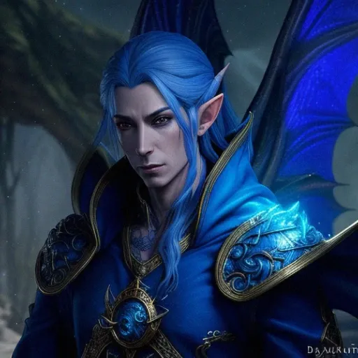

# Simear

## Age
Simear is approximately 75 years old, which is equivalent to early thirties for a half-elf.

## Family
- **Mother**: Ethear, a cloud dragon.
- **Father**: Tal’im Ran’dir, an adventurer.

Simear’s mother, Ethear, was a cloud dragon. His father, Tal’im Ran’dir, was part of an adventuring party that stumbled upon Ethear’s lair in the mountains. Initially, Ethear captured and held the adventurers, assuming they were of ill intent. Over time, Tal’im developed Stockholm syndrome and eventually won Ethear’s affection, leading to the release of the remaining adventurers. Tal’im chose to stay with Ethear, resulting in Simear’s birth.

- **Status**: Both parents are alive, to Simear’s knowledge.
- **Feelings**: Simear highly regards both of his parents. However, he found it difficult to meaningfully connect with either the elven or the draconic societies he grew up with. He respects both cultures and can interact well with each, but feels disconnected from them. This, along with his father’s habits, has led him to frequently travel as an adventurer.

## Pre-Flaming Retribution Life
Simear demonstrated an aptitude for building things at an early age. His father, Tal’im, sought out craftsmen to employ Simear when they lived with the elves. However, this was never for more than a couple of months at a time, as the family frequently went on adventures and visited dragons. In his mid-twenties, Simear met a group of merchants and, with his parents’ blessing, left to work as both a traveling smithy and a member of the caravan guard.

## Role in the Community
Simear spends much of his time repairing items and honing his creative crafting abilities.

## Personality Traits
- **Positive**:
  - Considerate of various cultures and adaptable.
  - Endearing to most people.
- **Negative**:
  - Somewhat easily angered and scary when provoked.

## Worldview
Simear is generally cynical, especially towards social systems and rigid structures, but he likes individuals. Despite his cynicism, he has a deep affection for people and has a practical view of life.

## Reason for Moving North
Simear was never deeply religious but saw little harm in believing. He initially ignored street preachers warning of a coming calamity. However, the schism within the leading religious order caught his attention and stirred a gnawing concern within him. He spoke with the caravan leadership about moving north, citing safety and potential wealth from their wares. He convinced them to follow the sect moving north, deeming them more honorable. Simear was prepared to leave the caravan if they did not agree to move north.

## Specific Goal
Simear seeks to master his crafting abilities and find a community where he truly belongs, bridging the gap between his elven and draconic heritage.

## Friends/Allies/Enemies/Rivals
- **Friend**: Karsten
  - **Nature**: Ally and potential friend.
  - **Interaction**: They met during a heated discussion among members of Karsten’s order. Karsten’s warnings of imminent cataclysmic destruction resonated with Simear’s distrust of organized religion, leading to their alliance.
  - **Status**: Busy with their respective organizations, Karsten might not remember Simear well.
- **Rivals**:
  - **Names**: Elanil and Faelar
  - **Nature**: Rivals from the elven community.
  - **Interaction**: They harassed and disrespected Simear due to his half-blood status. Physical confrontations diminished after Simear’s draconic abilities began manifesting, leading to fear and respect.
  - **Status**: Likely remained in their elven community, possibly affected by the Flaming Retribution.

## Fear or Phobia
Simear has a fear of longsword duels, as these have never gone well for him despite his father’s efforts.

## Favorite Things
Simear loves clouds, especially those with lightning. He considers being struck by lightning a good sign and warns people to stay away from him during storms.

# Jason's Responses for background
This is the Background for Simear a half elf Sorcerer.

    how old is your character? It depends on the relative life of a half-elf. I like the idea of being in the 75 years range if that equates the early to thethirties
    Tell me about your character's family?
    Simear’s mother was a cloud dragon named Ethear. His father’s adventuring party stubbled upon her as they worked their way across a high ridge of some mountains. The party was a motley crew of some rather unsavory species. She assumed them to be of ill intent when they stumbled into her eire. She ensnared them, holding them captive for several months eating most of his company. During this time his father (Tal’im Ran’dir) began to suffer from Stockholm’s syndrome. She slowly succame to his charm and apparent sincere affection for her. She released the remaining prisoners, but he refused to leave with the remnants of his party.

    Are they still alive? Yes…to Simear’s knowledge.
    How does your character feel about their family? Simear highly regards both of his parents. Simear found it difficult to meaningfully connect with either the elven or the draconic societies he grew up with. He respects both and can interact well with each culture. Regardless, he is disconnected in various ways from each. This, along with the habits of his father, has caused him to frequently travel as an adventurer.

    What did your character do before The Flaming Retribution? Simear demonstrated an aptitude for building things at an early age. When he lived with the elves, Tal’im sought out craftsmen to employ Simear. This was never for more than a couple months at a time as the family would go on adventures and visit the dragons. When Simear was in his mid-twenties he met a group of merchants and with the blessing of his mother and father left in their employ as both a traveling smithy as well as a member of the guard for the caravan.
    What does your character currently do for the community?
    He has spent much time repairing stuff and honing his creative crafting abilities.
    List at least 2 good personality traits: considerate of various cultures/adaptable. Endearing to most.
    List at least 1 negative personality trait: somewhat easily angered…scary when he is.
    What is your character’s worldview? (Optimistic, cynical, practical, joyful etc…)
    Few facades fool him. Social systems and rigid structures don’t sit well with him. This causes him to be somewhat cynical in some ways. However, he likes people individually and would eat them if it were legal.
    What made your character follow the community to the north?
    Simear was never a religious fellow but saw little harm in believing. He had heard a few street preachers concerning a coming calamity but thought little of it. The schism within the leading religious order caught his attention and stirred a gnawing concern within him. He spoke with the caravan leadership, but they were deaf to his concerns. When he heard that a sect of the order was going to leave their establishment he deemed them the more honorable. Convincing the caravan that it was in the interest of their safety to follow the departing sect of the order was proving to be a challenge. He finally convinced them that there would be a great need for their wares and thus much wealth to be made by moving north with the order. He would have left the caravan had they not gone with him. He had hoped to make this a last resort should he fail to convince them to go North.
    What is a specific goal that your character wants to achieve
    Create a minimum of 3 friends/allies/enemies/rivals for your character.
    Friend: Karsten. They met when a heated discussion broke out on the street among members of Karsten’s order. They began forcefully removing people from the temple for repeating warnings about an imminent cataclysmic destruction. This caught Simear’s attention. His natural distrust for the organized religious structure helped make for a sympathetic ear when Karsten began explaining the situation. This began the inner troublings that led Simear to persuade the caravan to follow Karsten’s sect to the North. While Simear would consider Karsten a friend or at least an ally, he acknowledges that Karsten probably has since forgotten Simear. Each has been very busy trying to get their respective organizations moved and settled.
    Rivals: Pick 2 elf names. They are “youths” from the elven community Simear grew up in. Since Simear is not a pure-blood, they hold a certain level of disrespect/distrust for him. There has historically been a fair degree of name-calling and harassment. While never agreed with by the elders of the community, if it was done out of their eyes, it was never corrected. As Simear has grown more quickly, they have found themselves physically unequal. Thus the physical abuse has diminished. Also, the last time they attempted to beat him up, he underwent a physical change that scared them and Simear. They also got a little burned. These were some of the first occasions when the question of how the draconic nature would manifest started being answered. These situations also revealed the innate and spontaneous use of magic. On this occasion, the community council was called and determined that Simear was to begin training as a sorcerer to prevent further injury. He was also removed from the village until control could be sufficiently demonstrated. The other boys were chastised as well for their instigation of the events.

    Name
    Nature of the relationship or how they interact with your character.
    Why they like/hate/respect/loathe your character
    Are they a part of the community? Not sure if the elven community is within the geographic region of the flaming retribution. But they would not be likely to leave their community and beloved lands.

    Does your character have a fear or a phobia? Being in longsword duals…these have never gone well for him; despite his father’s efforts.
    What are your character's favorite things? Clouds…particularly those with lightning. He has been struck by it 3 times. He considers it a good sign. But he also warns people to stay away from him in a storm.