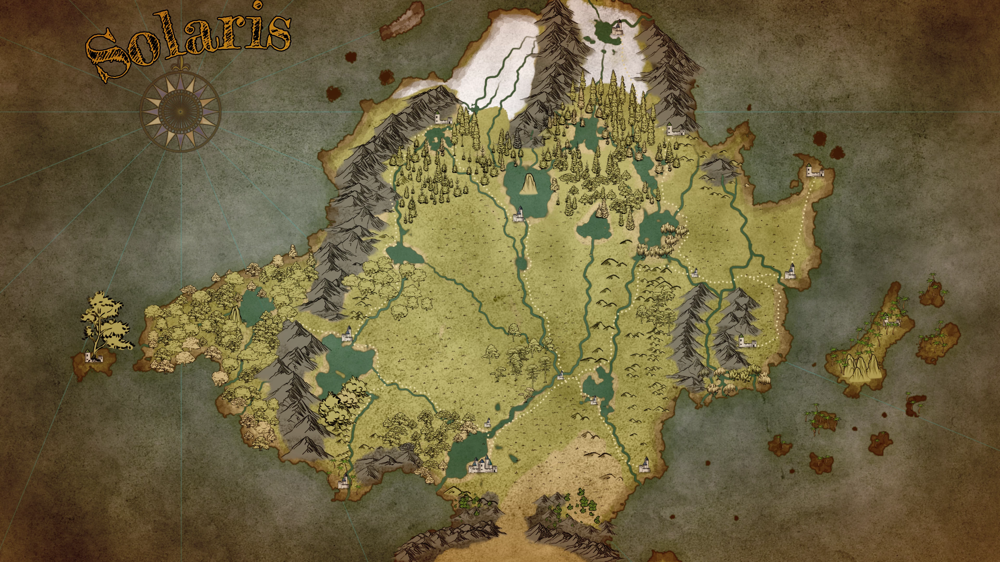

# Crown of the Immortals Pitch
## Feel of the Campaign
This will be a high magic high fantasy campaign that will be both **Character Driven** and **Story Driven** you will have access to all of the options in the **[Pathfinder](https://2e.aonprd.com/)** system with little limitation. So you will have access to **Sword and Sorcery** as well as **Guns and Technology**. This campaign will be high steaks with occasional punnyness and is intended to go all the way from **Level 1-20**.

## Setting Info: Aftermath

The campaign will take place in the World of **[Aetheria](../World/Aetheria.md)** on the continent of **[Solaris](../World/Locations/Solaris.md)** just a little over a year after the most *devastating disaster* that the world of ***[Aetheria](../World/Aetheria.md)*** has ever seen. 

The Sun Kingdom, known as **[The Blessed Realm](../World/Locations/Solaris/Old-World/The-Blessed-Realm/0-The-Blessed-Realm.md)** once known in the region for being the bringers of enlightenment, migrating from the south, sharing advancements of agriculture, technology and the ways of true magics. Over time the people of **[The Blessed Realm](../World/Locations/Solaris/Old-World/The-Blessed-Realm/0-The-Blessed-Realm.md)** became fat on the blessings and bounties that the Great God [Raythelion](../World/Religion/Raythelion.md) gave them, and began to impose Lordship over the free peoples of **[Solaris](../World/Locations/Solaris.md)** rather than the peaceful guides that they once were. 

Rather than being for the people, they decided that they new better how the people should be taken care of, and their hand of friendship turned into a fist of conquest. They turned from their old ways and started practicing new ways of worship. The prophets of [Raythelion](../World/Religion/Raythelion.md)  foretold of the impending doom that was coming upon them, but the inhabitants Ignored the warnings and punished the mouth pieces of the great God [Raythelion](../World/Religion/Raythelion.md)  to their peril. 

A little over a year ago, meteors and flaming debris fell down on the Blessed Kingdom and the very ground erupted with boiling geysers, destroying it and leaving the once great kingdom in ruin. This **[Flaming Retribution](../World/Events/The-Flaming-Retribution.md)** happened all across the continent of **[Solaris](../World/Locations/Solaris.md)** but you and your community, listened to and protected the prophets when you could and watched for the signs. They told you to travel north, and so you did. You avoided the **[Flaming Retribution](../World/Events/The-Flaming-Retribution.md)** and were saved from complete destruction.

# Player expectations
## Build the starting town with me
I would like to take the first session or two in order to build the starting town. The way that it will work is that I will have a number of prompts that I will give each of us to build a peace of the history of this town that was just created about a year ago. I want you to help me build the history of the region.

## Characters
your characters do not have to be from the starting town, they can be from anywhere. **[The Blessed Realm](../World/Locations/Solaris/Old-World/The-Blessed-Realm/0-The-Blessed-Realm.md)** was a very multi cultural kingdom, while having a heavier population of Humans than anything else, your character could literally be any race that you wanted, or you could be a refugee that found this place and became a part of the town. The only stipulation is that your character will have to have been a part of the town for *most* of the year.

## Backstories
Last game there wasn't much of an emphasis on back stories at all. In this campaign, I want to make the character's back stories and ambitions/goals a large part of the game, as well as the over arching stories, giving character specific stories complete adventures and weaving those stories into the over arching story of the campaign. and with that in mind, I need back stories as well as ideas of ambitions. I will provide a list of prompts for you to answer if you are concerned about not being able to write an effective back story and I would be more than happy to be a sounding board to bounce ideas off of. As this world if a bit of a green field, you can feel free to insert details and places into your backstory that aren't specifically spelled out.

# FAQ
## So fantasy Israel? 
So, I don’t think there is 1 real world correlation for 
[The Blessed Realm](../Locations/Solaris/Old-World/The-Blessed-Realm/0-The-Blessed-Realm.md). I wouldn’t exactly call them fantasy Israel. If I was modeling it after any ancient civilization, I think the correlation is more of a Roman civilization than anything. Primarily because the city-state of Rome actually started out as the big brother of the ancient world helping out their neighbors, then decided that it would be easier to rule over their neighbors rather than help them. (Over simplification)
 
I do grant you that the destruction of the kingdom is like something you would see in the Bible, but it is more of a Sodom and Gomorra than it is a judgement of Israel. The survivors village is kind of like Lot’s family. The Blessed Realm is completely destroyed.

I pulled from a lot of influences both historical and fictional, but I have read a lot of bible… so I am not surprised that it might have snuck in. 😀

The people not listening to and attacking the prophets as well as the remnant of "true believers" was definitely bible influenced. People be people even in a fantasy world. The idea of the setting is kind of a post apocalyptic fantasy setting. Not mad max, but a disaster that caused the end of a Golden Age. How will the world recover, right after the disaster, What survived? What was Destroyed?

## Is there a pantheon here or is [Raythelion](../World/Religion/Raythelion.md)  the only real god? 
As far as the pantheon is concerned, it is kind of a unique situation. There is one creator god and 4 ranks of lesser gods they are a combination of catholic saints, angels and an extension Raythelion’s will.  
  
here are only 3 members of the highest rank. ([Luminous Authority](../World/Religion/Deity-Hierarchy/1-The-Luminous-Authority.md)) which encompass the aspects of Creation, Justice/Order and Renewal/Growth. There is also an evil god that has his own dark pantheon. His name is [Erabose](../World/Religion/Erabose.md). He once fulfilled the aspects of both Justice/Order and Renewal/Growth, but chose to rebel against [Raythelion](../World/Religion/Raythelion.md)  for a reason unknown and now works along with his team as a foil against the world. [Raythelion](../World/Religion/Raythelion.md)  promoted 2 other gods to the position of ([Luminous Authority](../World/Religion/Deity-Hierarchy/1-The-Luminous-Authority.md)) when this happened, being careful not to grant any one of them too much power. The second rank ([Rank of Brilliance](../World/Religion/Deity-Hierarchy/2-The-Rank-of-Brilliance.md)) rule over more narrow categories of the world. Things like the elements, emotional states and Moral Laws, and the third rank ([The Rank of Guiding Luminecence](../World/Religion/Deity-Hierarchy/3-The-Rank-of-Guiding-Luminecence.md)) are the Gods that are the most involved in the people of [Raythelion](../World/Religion/Raythelion.md) 's lives and are more helpful. I think of them like catholic saints or the roman/greek deities. They are gods like a god of travels, god of war, or god of finding ect. Most of the upper ranked Deities, Including [Raythelion](../World/Religion/Raythelion.md)  are not worshiped by the masses as they do not often insert themselves in the lives of the people, being more focused on the bigger picture than on individuals. that is one of the things that made the Blessed Realm unique. They worshiped [Raythelion](../World/Religion/Raythelion.md)  directly, which is not often done. I am giving broad strokes here to not box in your creativity. You can feel free to insert any of the gods from pathfinder or any other pantheon into this pantheon, or retrofit one with a new name or even create a new one if you would like, but we would have to work together to make sure everything works or that there isn't a different deity that is already balanced and works with your concept.
	  
## How large is our starting town?
I see the starting town to be a small to mid-sized village maybe 500 people total, but I am not married to that. I would really like your input on what you would like for it. I am not passing the buck here, but I really want you guys to be able to have a say in some of the backstory of the world, which will make it easier for you to make compelling back stories for your characters. I really want this world to be something you are able to have agency in, and want to build it kind of like we did with the D&D college game. Adding points of interest and filling in the map as we go. If you are looking for guard rails, I can provide those, but just want to understand what you are digging for.  
  
I think the starting town will be about 1 weeks travel north of the devastation at a river fork. What was once the blessed kingdom, which is the lower quarter of the map, is now a collection of craters filled with boiling water and a steaming marsh land.

## how much downtime do you expect there to be?
Downtime will definitely be something that you can expect. I think I will do it about the same way I did it with Star Wars, where there is going to be some time gaps that happen between adventures. might not be between every adventure, but this campaign should be taking place over the course of in game years, not a month.

## Do you expect it to be more us roaming / traveling around or more us staying in or near one location and building upon it?
 As far as how I expect the campaign location is concerned. I am expecting there to be a home base that the group launches their adventures from. I have at least a few travel "chapters" in mind, but I am expecting the group to return to their home at the end of every adventure, Kind of like Bilbo returning to Baggend.

But hey, you guys to could totally surprise me and hate to settle and have wonderers lust. with a longing for the sea. Who knows. regardless, I can pivot if that is the group's desire.
