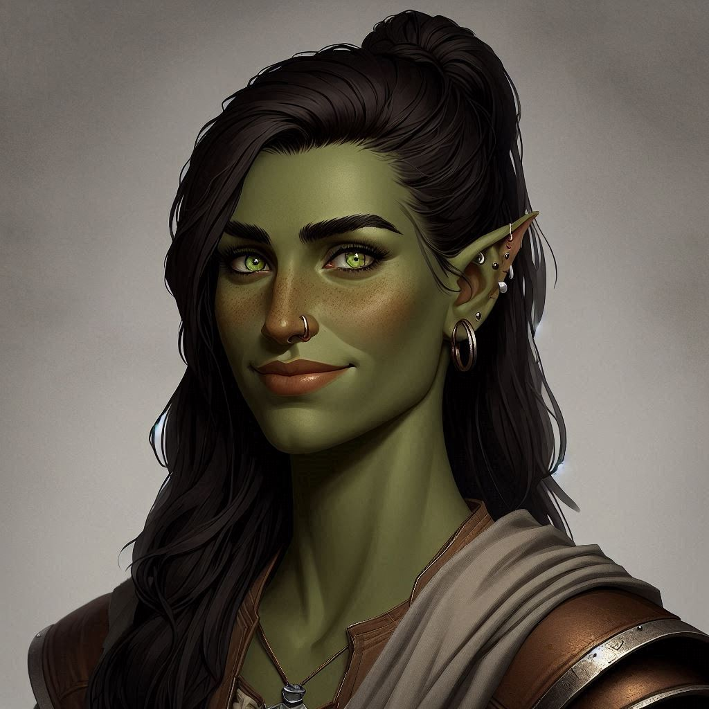

# Angel

## General Information
- **Full Name**: Angel Emersyn
- **Race**: Dromar
- **Role**: Teacher and Community Organizer
- **Age**: 32

## Appearance
- **Height**: 5'10"
- **Build**: Strong and athletic, yet with a gentle demeanor
- **Hair**: Long, dark, usually tied back
- **Eyes**: Bright green
- **Distinctive Features**: A kind smile that contrasts with her orcish heritage, always dressed in practical yet neat clothing suitable for teaching and organizing

## Background

### Family
Angel is the sister of [Cahir Emersyn](../../Crown-of-the-Immortals/PCs/Cahir-Emersyn.md). Her father was an orc, and her mother was a human. Despite the challenges and prejudices faced due to her mixed heritage, Angel has always been a source of strength and compassion within her family. Her father died in the Flaming Retribution, sacrificing himself to save his family. She has a strained but hopeful relationship with her brother, [Gald](Gald.md), who struggles with bitterness and anger.

### Personality Traits
- **Positive**:
  - Kind-hearted and compassionate
  - Organized and diligent
  - Empathetic and patient with others
- **Negative**:
  - Sometimes too trusting
  - Can be overly self-sacrificing

### Worldview
Angel is optimistic, believing in the inherent goodness of people and the possibility of redemption and renewal, even in the face of tragedy. Her faith in [Raythelion](../Religion/Raythelion.md) gives her strength and hope.

## Role in the Community
Angel serves as a teacher, guiding the young and imparting wisdom to the next generation. She is also a key organizer within the community, helping to manage supplies, plan events, and ensure that everyone has what they need. Her nurturing nature and strong organizational skills make her a beloved figure in the community.

## Goals and Aspirations
Angel seeks to heal the rifts caused by [the Flaming Retribution](../Events/The-Flaming-Retribution.md) and help rebuild a compassionate, inclusive society. She dreams of creating a sanctuary where all races and backgrounds are accepted and valued.

## Relationships

### Family
- **[Cahir Emersyn](../../Crown-of-the-Immortals/PCs/Cahir-Emersyn.md)**: Her protective and loyal brother. Their bond is strong, though they sometimes clash due to his pessimistic outlook.
- **[Gald Ironfang](Gald.md)**: Her other brother, who is bitter and provokes others. Angel hopes to help him find peace and purpose.

### Friends/Allies
- **[Alwor Thistlegift](../../Crown-of-the-Immortals/PCs/Alwor-Thistlegift.md)**: The gnome bard who is a source of wisdom and comfort for her. She often collaborates with him to boost the community's morale.
- **[Karsten Kendrick](../../Crown-of-the-Immortals/PCs/Karsten-Kendrick.md)**: The paladin who respects Angel for her unwavering faith and dedication to teaching and organizing the community.

### Rivals/Enemies
- **[Gald Ironfang](Gald.md)**: Though not an enemy, Gald's bitterness and provocations create tension. Angel constantly strives to mend their relationship.

## Fears and Phobias
Angel fears failing her community and losing more loved ones. She is also wary of the resentment and hatred that can fester within the survivors, threatening their unity and peace.

## Favorite Things
Angel loves teaching, organizing community events, and nurturing plants and flowers. She finds solace in the simple act of caring for others and making the world a better place, one small step at a time.