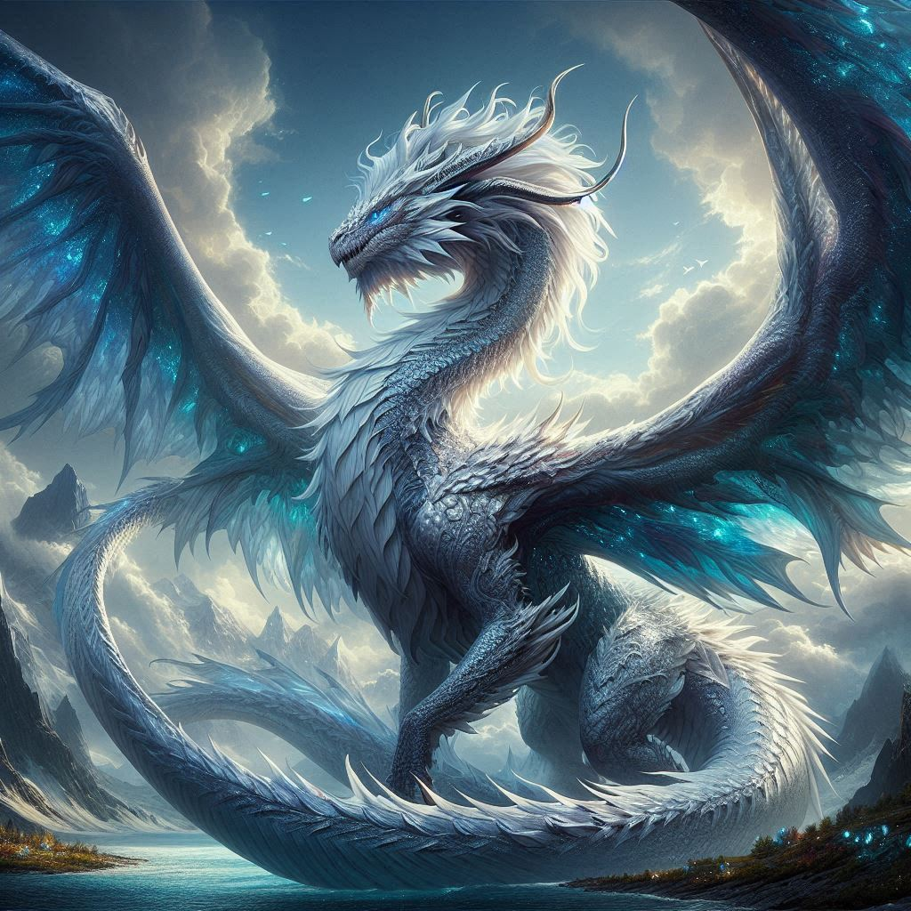
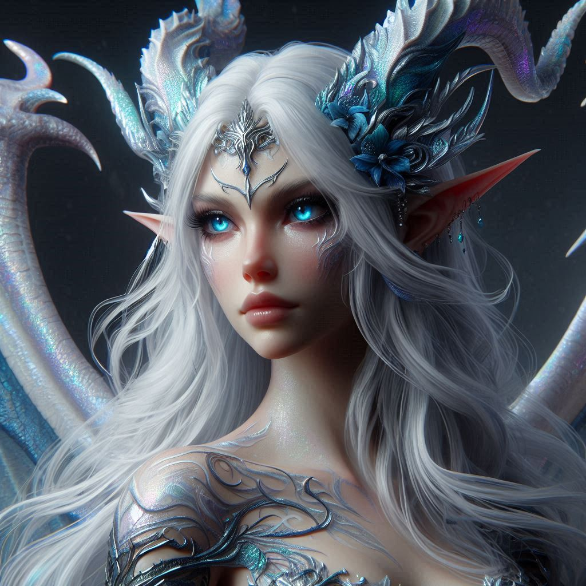

# Ethear

## General Information
- **Full Name**: Ethear, the Cloud Dragon
- **Race**: Dragon (Cloud Dragon)
- **Role**: Guardian of the Skies, Mother of Simear
- **Age**: Ancient (exact age unknown, but dragons of her kind can live for millennia)

## Appearance
- **Size**: Massive, with a wingspan that spans hundreds of feet
- **Scales**: Iridescent silver, shimmering with hues of blue and white
- **Eyes**: Piercing blue, like the clear sky after a storm
- **Distinctive Features**: Her scales glisten with a cloud-like mist that constantly surrounds her. She has long, elegant horns and a majestic crest that runs down her back.

## Background

### Family
Ethear's lineage is ancient and noble among the dragon kind. She comes from a line of powerful and wise dragons who have long been guardians of the skies. Her union with [Tal’im Ran’dir](Tal%E2%80%99im-Ran%E2%80%99dir.md), an Elven adventurer, was unexpected and unique, resulting in the birth of their half-dragon, half-elf son, Simear.

### Personality Traits
- **Positive**:
  - Wise and knowledgeable
  - Protective and nurturing, especially towards her family
  - Calm and composed, exuding a serene presence
- **Negative**:
  - Can be aloof and distant to those outside her family
  - Holds grudges for a long time, especially against those who threaten her loved ones

### Worldview
Ethear sees herself as a guardian of balance and peace in the skies and lands she oversees. She believes in the power of knowledge and wisdom, often preferring diplomacy over conflict. However, she is fiercely protective and will not hesitate to unleash her wrath on those who endanger her family or her domain.

## Goals and Aspirations
Ethear's primary goal is to protect her family and ensure their safety. She also seeks to preserve the natural balance and the ancient wisdom of the dragon kind. She hopes to pass on her knowledge to Simear and guide him in harnessing his unique heritage.

## Relationships

### Family
- **[Tal’im Ran’dir](Tal%E2%80%99im-Ran%E2%80%99dir.md)**: Her human mate, whom she deeply loved. His death in the Flaming Retribution was a significant loss for her.
- **[Simear](../../Crown-of-the-Immortals/PCs/Simear.md)**: Her beloved son, whom she protects and guides from afar. She sees great potential in him and strives to help him embrace his dual heritage.

### Friends/Allies
- **[Elanil Moonshadow](Elanil.md)**: A respected elven mage and scholar who occasionally seeks Ethear's wisdom on arcane matters.

### Rivals/Enemies
- **[Vorath the Betrayer](Vorath-the-Betrayer.md)**: A fallen Radiant whose actions brought great suffering. Ethear sees him as a threat to the balance she strives to maintain.

## Fears and Phobias
Ethear fears the loss of her remaining family and the spread of chaos and destruction. She is also wary of the potential misuse of the ancient knowledge and power she possesses.

## Favorite Things
Ethear cherishes the serenity of the skies and the beauty of the natural world. She enjoys moments of solitude, gliding through the clouds, and observing the world from above. She also values the ancient texts and artifacts of her kind, often spending time in deep contemplation and study.