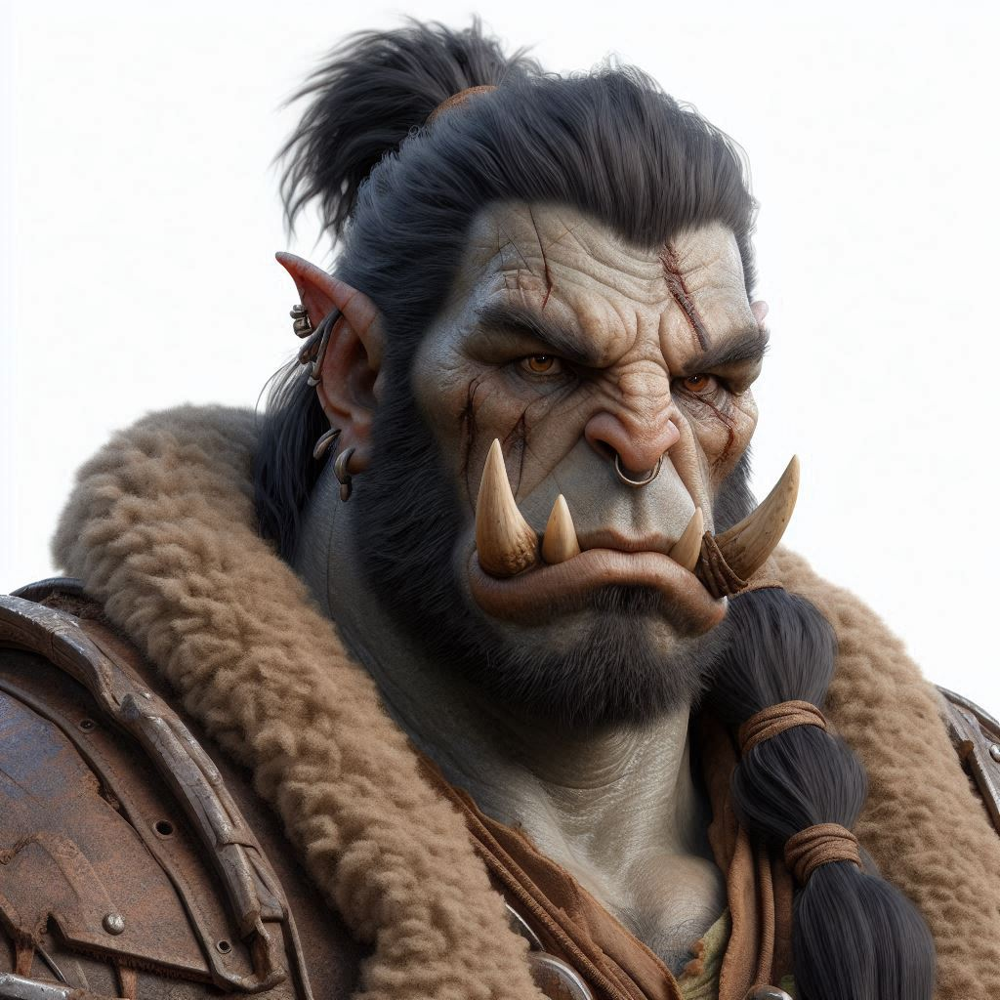

# Gald Ironfang

## General Information
- **Full Name**: Gald Ironfang
- **Race**: Orc
- **Class**: Barbarian
- **Age**: 34 years old
- **Role**: Woodsman, Loner, Rival

## Appearance
- **Height**: 6'5"
- **Build**: Muscular and imposing
- **Hair**: Short, black hair often tied in a topknot
- **Eyes**: Deep brown, intense and brooding
- **Distinctive Features**: Gald has numerous scars from battles and confrontations. He has a prominent tusk and wears rugged, practical clothing suitable for the forest.

## Background

### Family
Gald is the brother of [Cahir Emersyn](../../Crown-of-the-Immortals/PCs/Cahir-Emersyn.md). He was raised in a mixed family, with his father being an Orc and his mother a human. Gald's relationship with his family is strained, especially with his half-brother, due to his father's marriage to a human after his first wife’s death.

### Personality Traits
- **Positive**:
  - Strong and resilient
  - Skilled woodsman and hunter
  - Fiercely independent
- **Negative**:
  - Bitter and resentful, particularly towards the community
  - Provocative and prone to conflicts
  - Distrustful of others, preferring solitude

### Worldview
Gald is cynical and disillusioned, especially after the Flaming Retribution and the loss of his Orc friends. He harbors resentment towards those he perceives as responsible for the community’s troubles and is deeply mistrustful of outsiders. Despite his bitterness, he maintains a strong sense of loyalty to his remaining family.

## Role in the Community
Gald works as a woodsman, primarily keeping to himself. He provides for the community by gathering wood and hunting, but he rarely interacts with others. His skills are valued, though his attitude often puts him at odds with the rest of the community.

## Goals and Aspirations
Gald seeks to survive and protect his sister, [Angel](Angel.md), whom he deeply cares for despite his overall bitterness. He is driven by a desire to prove his strength and independence, though he struggles with his anger and resentment.

## Relationships

### Family
- **[Cahir Emersyn](../../Crown-of-the-Immortals/PCs/Cahir-Emersyn.md)**: His half-brother and rival. Their relationship is fraught with tension and rivalry due to their different upbringings and Gald's resentment towards their father’s marriage to a human.
- **[Angel](Angel.md)**: His sister, whom he loves and is very protective of. [Angel](Angel.md)’s kind nature often clashes with Gald’s bitterness, but she remains a source of comfort for him.

### Friends/Allies
- **Balanka**: A female Dromaar and a friend of Cahir. While Gald respects Balanka for her strength and leadership, their interactions are limited due to his solitary nature.

### Rivals/Enemies
- **Community Members**: Gald is generally at odds with many in the community, holding them partly responsible for the loss of his friends and his bitterness towards his father’s decision.

## Fears and Phobias
Gald fears losing his sister, [Angel](Angel.md), the last remaining family member he truly cares for. He also harbors a deep-seated fear of being betrayed or abandoned, fueling his distrust of others.

## Favorite Things
Gald finds solace in the solitude of the forest. He enjoys the physical exertion of his work, the quiet of nature, and the sense of control it gives him. Despite his rough exterior, he has a deep appreciation for the simple beauty of the natural world.