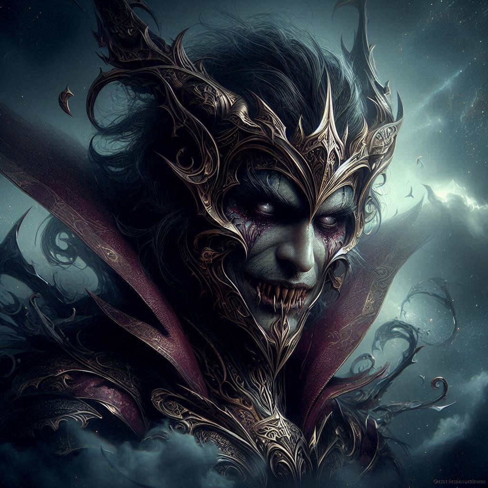

# Maldran the Deceiver

## Early Life

- **Name**: Maldran
- **Title**: The Deceiver
- **Origin**: Born in the heartlands of Solaris, within the ancient city of Lumopolis
- **Background**: Maldran was a charismatic and ambitious individual from a young age. Gifted with the ability to sway hearts and minds, he quickly rose to prominence in political circles.

## Ascension to Radiant

- **Divine Selection**: Chosen by Raythelion for his persuasive abilities and unwavering determination, Maldran was granted a divine spark, becoming a Radiant.
- **Role**: Maldran's role as a Radiant involved diplomacy, negotiation, and mediation. He was tasked with resolving conflicts and fostering peace between warring factions.

## The Path to Deception

- **Ambition**: Maldran's thirst for power and influence grew with his newfound status as a Radiant. He saw his divine gift not as a tool for peace but as a means to further his own agenda.
- **Manipulation**: Over time, Maldran began to use his persuasive abilities to manipulate others for personal gain. He saw no qualms in bending the truth and sowing discord to achieve his objectives.

## Descent into Deceit

- **Corruption**: Erabose, the dark god, recognized Maldran's potential for deception and corruption. He whispered promises of greater power and control, tempting Maldran to embrace his darker impulses.
- **Betrayal of Trust**: Maldran's actions became increasingly deceitful and self-serving. He exploited his position as a Radiant to further his own ambitions, betraying the trust of those who once looked to him for guidance.

## Transformation and Fall

- **Betrayal Unveiled**: Eventually, Maldran's deceit was uncovered, and the extent of his betrayal became known. His fellow Radiants were horrified by his actions, and Raythelion himself cast him out of the divine order.
- **Exile and Shame**: Branded as the Deceiver, Maldran was exiled from the Blessed Realm and stripped of his divine powers. He became an outcast, haunted by the shame of his fall from grace.

## Legacy and Impact

### Seeds of Mistrust

- **Legacy of Deception**: Maldran's story serves as a cautionary tale of the dangers of unchecked ambition and deceit. His fall from grace left a stain on the reputation of Radiants, sowing seeds of mistrust and suspicion.
- **Cultural Impact**: The tale of Maldran is often invoked as a reminder to question the motives of those in positions of power and authority. His name is synonymous with betrayal and treachery.

### Lessons Learned

- **Symbol of Corruption**: Maldran's story is a stark reminder of the corrupting influence of power and the importance of integrity and honesty. His downfall serves as a warning against the allure of deceit and manipulation.
- **Impact on Radiants**: The revelation of Maldran's deception led to increased scrutiny and vigilance among the Radiants. They now understand the need to guard against the temptation of personal gain and remain true to their principles.

## Final Notes

- **Myth and Reality**: Over time, Maldran's story has taken on a mythic quality. Some view him as a tragic figure consumed by his own ambition, while others see him as a villainous archetype of betrayal.
- **Continued Influence**: Despite his fall, Maldran's legacy endures as a cautionary tale for all who seek power and influence. His story serves as a reminder of the dangers of moral compromise and the importance of remaining true to one's values.
- **Radiant's Burden**: The tale of Maldran serves as a sobering reminder to Radiants of the weight of their responsibilities. They must always remain vigilant against the temptation of corruption and uphold the ideals of justice and righteousness.

