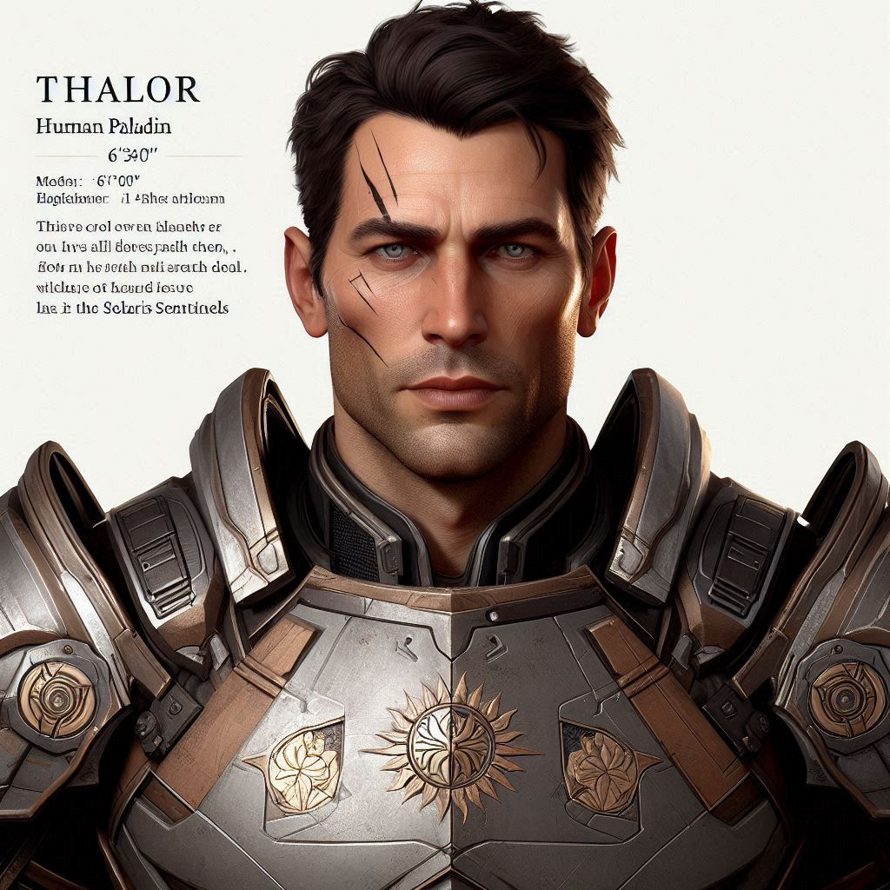

# Thalor

## General Information
- **Full Name**: Thalor
- **Race**: Human
- **Class**: Paladin
- **Age**: 34 years old
- **Role**: Protector, Solaris Sentinel

## Appearance
- **Height**: 6'0"
- **Build**: Muscular and imposing
- **Hair**: Short, dark brown, usually kept neat
- **Eyes**: Steel gray, intense and focused
- **Distinctive Features**: Thalor has a scar running across his left cheek from a past battle. He wears durable, practical armor adorned with the symbols of Raythelion and the Solaris Sentinels.

## Background

### Early Life
Thalor was born in a small village on the outskirts of the Blessed Realm. His family was poor, and he learned to fend for himself from a young age. When he was twelve, his village was attacked by marauders, and Thalor witnessed the death of his parents. He was saved by a passing group of Solaris Sentinels, who took him in and raised him as one of their own.

### Solaris Sentinels
Thalor's life with the Solaris Sentinels was rigorous. He quickly adapted to their strict training regimen, showing an aptitude for both combat and leadership. Despite his harsh upbringing, Thalor developed a strong sense of justice and a fierce loyalty to his new family—the Sentinels. However, his practical and sometimes ruthless approach to challenges often puts him at odds with his fellow Sentinel, Karsten Kendrick.

## Personality Traits
- **Positive**:
  - Tactical and strategic
  - Highly skilled in combat
  - Loyal and protective
- **Negative**:
  - Can be overly critical of others
  - Tends to challenge authority
  - Sometimes acts impulsively

## Worldview
Thalor believes that the ends justify the means. He values adaptability and quick thinking over rigid adherence to tradition. This belief often leads to clashes with Karsten, who he sees as too inflexible and dogmatic.

## Role in the Community
Thalor is a respected protector and warrior within the community. His skills and bravery have earned him the admiration of many, though his unorthodox methods sometimes draw criticism. He is often seen leading scouting missions and defending the community from external threats.

## Relationships

### Rivalry with Karsten Kendrick
Thalor and Karsten's rivalry is well-known among the Solaris Sentinels. Thalor respects Karsten's dedication but frequently challenges his decisions and methods, believing that a more adaptable approach is necessary in these uncertain times. Their rivalry is marked by a mix of professional respect and personal friction.

### Friends/Allies
- **Young Sentinels**: Many younger members of the Solaris Sentinels look up to Thalor for his adaptability and combat prowess.
- **Local Villagers**: Thalor maintains strong ties with the local villagers, who appreciate his direct and effective protection.

### Enemies
- **Forces of Darkness**: Thalor is a fierce opponent of the dark forces threatening the land, dedicating his life to their eradication.

## Fears and Phobias
Thalor fears failing his duty to protect the Blessed Realm and the community. He is also wary of becoming too rigid and losing the ability to adapt to new challenges.

## Favorite Things
Thalor enjoys sparring and training, constantly seeking to improve his skills. He has a passion for strategy games, which help him refine his tactical thinking. In his downtime, Thalor finds peace in the forests, reconnecting with his rural heritage.