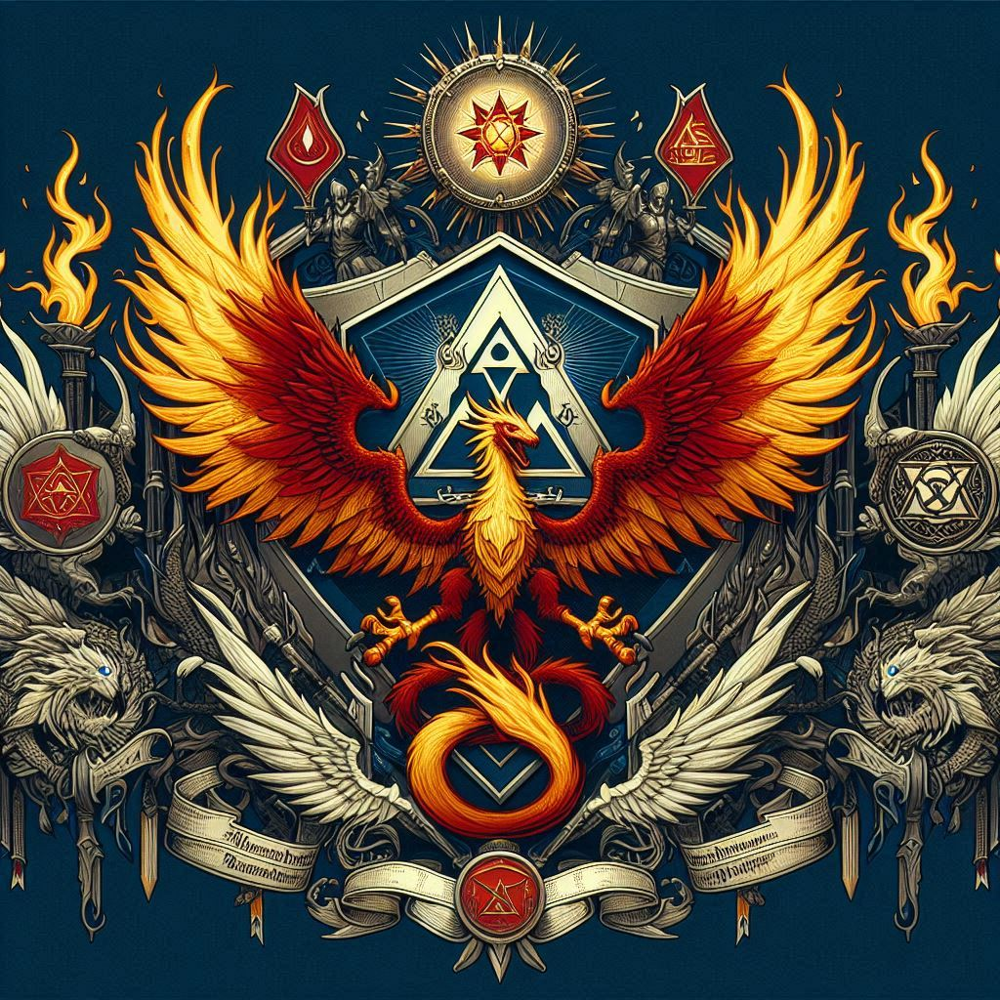

# Order of the Blessed Realm

The Order of the Blessed Realm was a once-prominent organization in the Sun Kingdom, known for being the bringers of enlightenment. Originally migrating from the south, they shared advancements in agriculture, technology, and the ways of true magic with the people of Solaris.

Over time, however, the Order began to impose lordship over the free peoples of Solaris rather than acting as peaceful guides. They abandoned their old ways and started practicing new forms of worship. Prophets of Raythelion foretold of impending doom, but the inhabitants ignored the warnings and punished the mouthpieces of the great god Raythelion, leading to their downfall.

The Order's stronghold, the Blessed Kingdom, was destroyed by the Flaming Retribution, a catastrophic event that left the once-great kingdom in ruins. With the destruction of the Blessed Realm, the Order ceased to exist, becoming a relic of the past.
