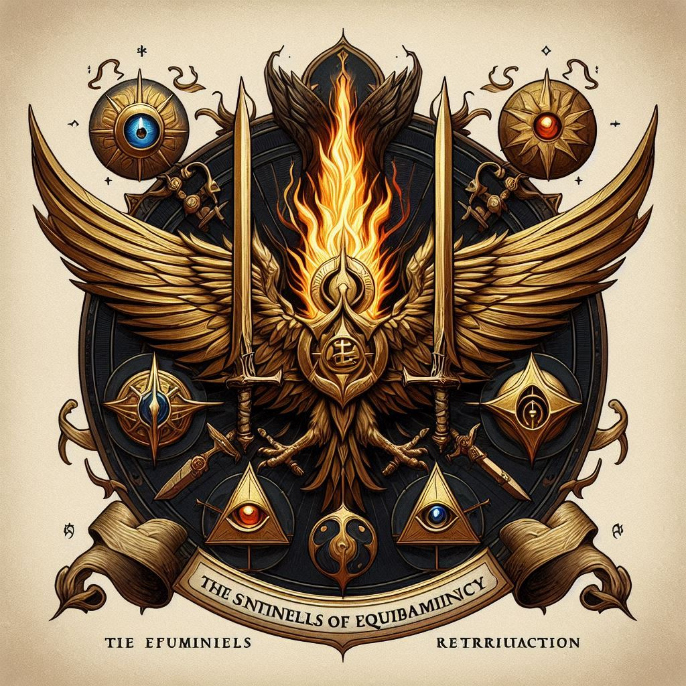

# Sentinels of Equilibrium
 

The Sentinels of Equilibrium are an ancient order dedicated to preserving balance and harmony in the world of Aetheria. Formed in the wake of cosmic upheavals and cataclysms, they emerged as guardians of the delicate equilibrium between opposing forces.

## Mission and Purpose

The primary mission of the Sentinels of Equilibrium is to maintain balance and order in the world, ensuring that no single force or faction gains unchecked dominance. They strive to uphold the natural balance between light and darkness, life and death, creation and destruction, guiding the course of destiny with wisdom and foresight.

## Values and Ideals

The members of the Sentinels embody the principles of neutrality, impartiality, and enlightenment. They reject the extremes of fanaticism and dogma, embracing a philosophy of moderation and equilibrium. Their commitment to balance transcends personal desires and ambitions, as they seek to harmonize the divergent forces that shape the fabric of reality.

## Structure and Leadership

Led by a council of venerable sages and enlightened masters, the Sentinels of Equilibrium operate as a clandestine order with a decentralized hierarchy. Initiates undergo rigorous training in the arts of diplomacy, meditation, and martial prowess, honing their minds and bodies to serve the greater good. Each Sentinel is entrusted with a specific domain or aspect of balance, ranging from the cosmic to the terrestrial.

## Symbol and Motto

The emblem of the Sentinels of Equilibrium is a stylized yin-yang symbol, representing the interplay of opposing forces and the inherent unity of all existence. Their motto, "In balance, we endure," reflects their unwavering commitment to maintaining harmony amidst the chaos of the world.

## Activities and Endeavors

The Sentinels of Equilibrium engage in a wide range of activities aimed at preserving balance and order. From mediating conflicts and brokering peace treaties to thwarting the machinations of extremist factions, they tirelessly work to mitigate disruptions to the natural order. They also serve as mediators between warring deities and rival pantheons, seeking to prevent cosmic conflicts that could destabilize the entire world.

## Legacy and Influence

Though shrouded in mystery and secrecy, the Sentinels of Equilibrium wield considerable influence behind the scenes, shaping the course of history in subtle yet profound ways. Their efforts have prevented numerous catastrophes and averted existential threats to the world, earning them the gratitude and respect of those who value stability and harmony.

