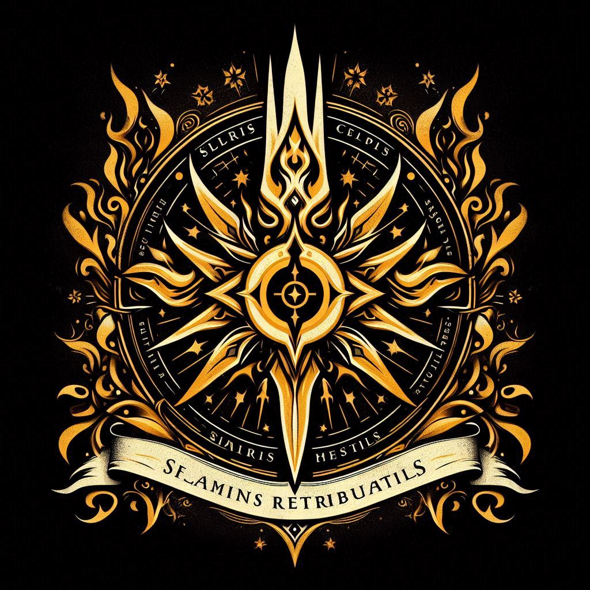

# Solaris Sentinels

The Solaris Sentinels were a secret sect within [the Order of the Blessed Realm](Order-of-the-Blessed-Realm.md), operating as highly trained and devoted champions for the protection of the order and the community against evil forces. 

Originally established as a paladin sect, the Solaris Sentinels were renowned for their discipline, dedication, and martial prowess. They were tasked with safeguarding the order's interests and upholding its ideals in the face of adversity.

However, with the destruction of [the Blessed Realm](../Locations/Solaris/Old-World/The-Blessed-Realm/0-The-Blessed-Realm.md) and the onset of[ the Flaming Retribution](../Events/The-Flaming-Retribution.md), the fate of the Solaris Sentinels remains uncertain. It is likely that the once-venerated organization has been disbanded or decimated, its members scattered or lost in the chaos that engulfed [Solaris](../Locations/Solaris.md).