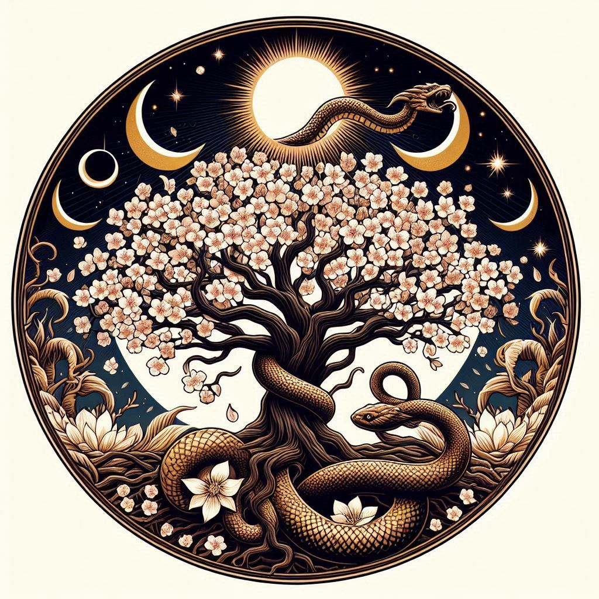

# Verdanth, the Matron of Life

**Title**: The Greenwarden

**Domain**: Growth, Renewal, Nature

**Symbol**: A blooming tree encircled by an ouroboros, symbolizing the eternal cycle of life and nature's perpetual renewal.

**Followers' Epithet**: Verdanth's Bloom

**Divine Philosophy**: Verdanth's followers, known as Verdanth's Bloom, are the stewards of the earth. They embrace the cycles of life, understanding that death and rebirth are natural and necessary for the continuation of life. They are often seen as healers, druids, and agriculturists who honor the changing seasons and the nurturing aspect of nature. Verdanth's presence is felt in every new sprout, every healed wound, and in the silent strength of the growing trees.

**Rituals and Worship**:
- **The Greening Rite**: A spring festival celebrating new growth, where seeds are blessed and planted to honor Verdanth's gift of renewal.
- **The Harvest Homage**: An autumnal ceremony giving thanks for the bounty of the harvest, recognizing Verdanth's role in the abundance of nature.

**Influence and Manifestations**:
- **The Verdant Touch**: A miraculous occurrence where barren lands bloom overnight, a sign of Verdanth's favor.
- **The Circle of Life**: Sacred groves where wildlife thrives, untouched by disease or famine, embodying Verdanth's protective embrace.

**Sacred Texts and Teachings**:
- **The Codex of Seasons**: A compilation of teachings and parables illustrating the sacred cycles of growth and decay, life and death, as guided by Verdanth.
- **The Lore of the Land**: Oral traditions passed down through generations, recounting Verdanth's influence on the natural world and the responsibilities of her followers.

## **Prayers and Chants**:
- **The Chant of Sprouting**: A melodious prayer sung during planting, invoking Verdanth's blessing for a fruitful yield.
- **The Whisper of Withering**: A somber chant recited during the fall, acknowledging the necessity of endings and the promise of future growth.
