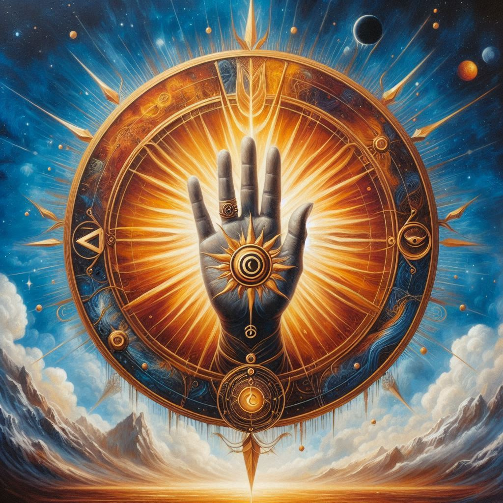

# Aurion, the Prime Architect

- **Title**: The Prime Architect
- **Domain**: Creation, Beginnings, Inspiration
- **Symbol**: A radiant sunburst emanating from an open palm
- **Followers' Epithet**: Aurion's Craftsmen
- **Divine Philosophy**: Aurion teaches that creation is the purest form of expression. His followers believe in the sanctity of new beginnings and the power of innovation. They are often creators, artists, and inventors, seeking to mirror Aurion's boundless creativity in their works. 

### Origins and Role
Aurion stands as the divine embodiment of creation, weaving the fabric of existence with his celestial hands. He is revered as the architect of worlds and the weaver of destinies, guiding the cosmos through its genesis and nurturing the sparks of inspiration that ignite new beginnings.

### Divine Attributes
The essence of Aurion's being resonates with the boundless potential of creation. His touch ignites the flames of innovation, inspiring mortals to craft marvels that shape the world around them. Aurion's presence infuses the universe with a sense of wonder and possibility, fueling the aspirations of dreamers and visionaries.

### Symbols and Iconography
The symbol of Aurion—a radiant sunburst emanating from an open palm—represents the expansive reach of his creative influence. It symbolizes the boundless potential of creation and the nurturing touch of divine inspiration that breathes life into the cosmos.

### Followers and Worship
Aurion's followers, known as Aurion's Craftsmen, are artisans, architects, and innovators who seek to channel his divine essence in their works. They view creation as a sacred act, honoring Aurion's teachings as they strive to manifest their visions in the material world.

### Rituals and Worship
- **The Dawn's Inspiration**: A daily ritual where followers greet the dawn with prayers of gratitude for Aurion's creative bounty, seeking inspiration for their endeavors.
- **The Forge of Creation**: A solemn ceremony where craftsmen gather to dedicate their works to Aurion, invoking his blessing upon their creations and offering thanks for the gift of inspiration.

### Influence and Manifestations
Aurion's influence is felt in the creative endeavors of mortals, from the grandeur of architectural marvels to the intricacies of fine art. His divine touch infuses the world with beauty and innovation, inspiring awe and reverence in all who behold his creations.

### Sacred Texts and Teachings
- **The Tome of Genesis**: A sacred text that chronicles Aurion's divine works and imparts wisdom on the principles of creation. It serves as a guide for Aurion's followers, offering insights into the nature of inspiration and the art of innovation.

### Legacy and Influence
Aurion's legacy endures through the works of his followers, whose creations serve as testaments to his divine influence. From towering monuments to masterful works of art, each creation bears the mark of Aurion's creative touch, inspiring wonder and admiration for generations to come.

## Prayer to Aurion, the Prime Architect

Oh, Aurion, Prime Architect divine,
Whose radiant touch brings creation to shine,
In your presence, we seek to refine,
Our works of art, our designs align.

Grant us inspiration, from your boundless well,
To shape our visions, in stories we tell,
With hands of skill, and hearts that swell,
In your image, our dreams compel.

Guide our hands, as we craft and create,
In every endeavor, may we emulate,
Your boundless creativity, ever great,
In your light, may we elevate.

Aurion, architect of worlds untold,
In your name, our talents unfold,
With reverence, our works behold,
In your grace, may we grow bold.

Amen.
