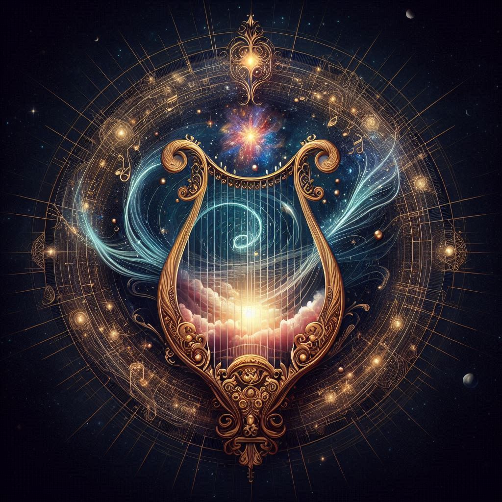

# Cadens, the Melodic Maestro

- **Title**: The Melodic Maestro
- **Domain**: Music, Harmony, Inspiration
- **Symbol**: A lyre with celestial notes emanating from its strings, representing the harmonious melodies that resonate throughout the cosmos.
- **Followers' Epithet**: Cadens's Minstrels
- **Divine Philosophy**: Cadens's teachings emphasize the transformative nature of music as a universal language that transcends boundaries and connects souls. His followers, known as Cadens's Minstrels, believe in the power of melodies to inspire joy, heal wounds, and foster unity among all beings. They view music as a divine gift, capable of elevating consciousness and enriching the human experience.
- **Rituals and Worship**:
  - **Harmony's Crescendo**: A grand celebration held during celestial alignments, where followers come together to perform symphonies and ballads in praise of Cadens, fostering communal bonds through shared musical expression.
  - **Melodic Meditation**: Daily rituals involve chanting sacred hymns and playing musical instruments to attune oneself to Cadens's divine resonance, seeking inspiration and guidance through the melodies.
- **Influence and Manifestations**:
  - **Echoes of Euphony**: In sacred groves and concert halls, followers believe they can hear Cadens's melodies echoing through the air, inspiring awe and reverence.
  - **Harmonic Vision**: Devotees experience visions of radiant compositions and ethereal performances, interpreting them as messages from Cadens guiding their artistic endeavors.
- **Sacred Texts and Teachings**:
  - **The Melodious Codex**: An anthology of musical compositions and philosophical musings on the nature of harmony, believed to be inspired by Cadens's divine inspiration.
  - **The Ballads of Unity**: Poetic verses that extol the virtues of collaboration, empathy, and understanding, conveyed through allegorical tales and parables set to music.
- **Prayers and Chants**:
  - **The Song of Serenity**: A tranquil melody sung during times of strife, invoking Cadens's soothing presence to calm troubled hearts and minds.
  - **The Anthem of Unity**: An uplifting chorus performed during festivals and gatherings, celebrating the diversity of voices and the power of music to unite all beings in harmony.

## Prayer to Cadens, the Melodic Maestro

O Cadens, whose divine melodies grace the heavens,
We offer our voices in humble supplication,
For you are the Maestro of harmony,
Whose music transcends mortal limitations.

Grant us the gift of inspiration,
That our compositions may echo your celestial tunes,
Guide our hands as we pluck the strings of life,
And weave melodies that uplift and commune.

In the cadence of your divine rhythm,
We find solace amidst life's discordant strains,
May your harmonies unite all hearts,
And banish sorrow with joyful refrains.

As we sing your praises, O Melodic Maestro,
May our souls resonate with your eternal song,
For in music's embrace, we find communion,
And in your presence, we forever belong.
