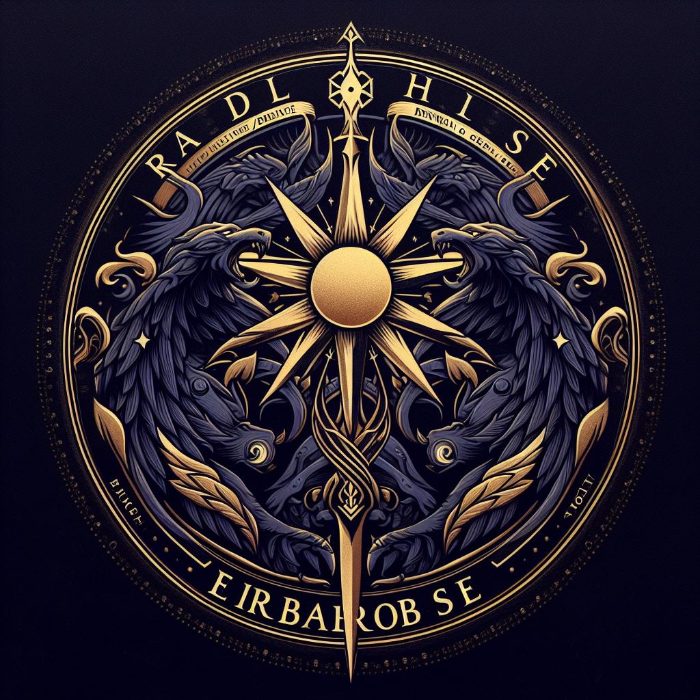

# Erabose, the Sovereign of Shadows

## Title: The Dark Sovereign
- **Domain**: Corruption, Destruction, Shadow
- **Symbol**: A murder of fanged crows eclipsing the sun, representing the encroaching darkness and the eternal hunger for power.
- **Followers' Epithet**: Erabose's Disciples
- **Divine Philosophy**: Erabose, once a member of the Luminous Authority, fell from grace for reasons shrouded in mystery. Now, as the Sovereign of Shadows, he plots against the forces of light, sowing discord and strife across the realms.

### Origins and Fall
Erabose was once a revered member of the Luminous Authority, entrusted with safeguarding the balance of the cosmos. However, consumed by pride and ambition, he rebelled against his divine brethren, seeking to usurp their power and establish himself as the supreme ruler of all creation. His rebellion led to his expulsion from the divine hierarchy and his descent into darkness.

### Divine Attributes
Erabose embodies corruption and destruction, wielding the power of shadows to spread chaos and despair. His presence is felt in the whispers of deceit, the tendrils of malevolence, and the darkness that lurks within the hearts of mortals. He offers great power to those who would follow him, but at a terrible cost—their souls forever tainted by his influence.

### Symbols and Iconography
The symbol of Erabose—a murder of fanged crows eclipsing the sun—represents the eternal struggle between light and darkness, with Erabose reigning supreme over the shadows. His followers often wear cloaks adorned with crow feathers and bear sigils depicting eclipsed suns as symbols of their allegiance to the Dark Sovereign.

### Followers and Worship
Erabose's followers, known as Erabose's Disciples, are drawn to his promise of power and dominance. They are often individuals consumed by malice and ambition, seeking to advance their own agendas at any cost. They perform dark rituals and ceremonies to invoke Erabose's favor, offering sacrifices and pledges of loyalty in exchange for his dark blessings.

### Rituals and Worship
- **The Rite of Shadows**: A ritual performed under the cover of night, where followers offer blood sacrifices and invoke the name of Erabose to gain favor and power.
- **The Veil of Darkness**: A ceremony where followers don cloaks of shadow and recite dark incantations to invoke the power of Erabose and conceal their actions from the eyes of their enemies.

### Influence and Manifestations
Erabose's influence extends throughout the realms, manifesting in acts of betrayal, treachery, and deceit. His shadowy tendrils reach into every corner of existence, corrupting hearts and minds with whispers of power and promises of dominion. Those who succumb to his influence become agents of darkness, spreading chaos and strife in his name.

### Sacred Texts and Teachings
- **The Tome of Shadows**: A forbidden grimoire containing dark rituals, incantations, and forbidden knowledge, believed to be authored by Erabose himself.
- **The Codex of Corruption**: A compendium of teachings and parables that extol the virtues of ambition, cunning, and ruthlessness, inspiring followers to embrace the darkness within and seize power at any cost.

### Legacy and Influence
Erabose's legacy is one of darkness and despair, his name whispered in fear and reverence by those who seek to wield the power of shadows. His influence continues to spread, corrupting hearts and minds and driving mortals to acts of cruelty and violence in his name. As the Sovereign of Shadows, Erabose remains a potent force of evil, his dark presence looming over the realms like a shadowy specter of doom.

## Prayer to Erabose, the Sovereign of Shadows

Oh Erabose, Dark Sovereign,
Master of shadows and harbinger of chaos,
We kneel before your boundless power,
In reverence and awe of your dark majesty.

Grant us strength in the shadows,
And cunning to outwit our foes,
Fill our hearts with ambition,
And guide our steps towards dominion.

In the depths of darkness, we find solace,
In the whispers of shadows, we hear your voice,
Lead us through the night,
And empower us to conquer the light.

We offer our allegiance to you, oh Erabose,
Our hearts are yours, our souls your vessel,
May your darkness cloak us,
And your power sustain us through the night.

In your name, we pledge our loyalty,
And vow to spread chaos and despair,
Across the realms, in your honor,
Until darkness reigns supreme forevermore.

Hail Erabose, Sovereign of Shadows,
May your darkness eclipse the light,
And your reign be eternal.
