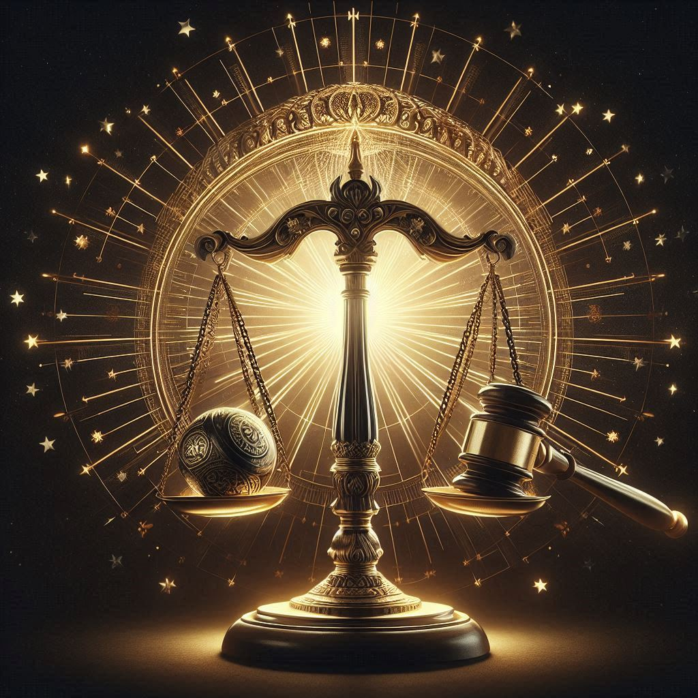

# Justicar, the Guardian of Balance

- **Title**: The Scalebearer
- **Domain**: Justice, Order, Balance
- **Symbol**: A set of balanced scales superimposed over a gavel, representing the impartiality and decisiveness required to maintain justice.
- **Followers' Epithet**: Justicar's Sentinels
- **Divine Philosophy**: The Sentinels are the embodiment of Justicar's will, serving as judges, lawmakers, and enforcers. They are the bastions of order in a world teeming with chaos, ensuring that justice prevails in all spheres of society.

### Origins and Role
Justicar is tasked with upholding the delicate balance of all things, ensuring that justice is served without bias or prejudice. His divine mandate encompasses the preservation of order and the enforcement of moral law, guiding mortals towards righteousness and accountability.

### Divine Attributes
Justicar embodies the principles of fairness, equity, and impartiality. His presence instills a sense of righteousness in those who seek justice, inspiring them to uphold the law and champion the cause of the oppressed. Justicar's scales weigh the deeds of mortals with unwavering precision, determining their worthiness in the eyes of the divine.

### Symbols and Iconography
The symbol of Justicar—a set of balanced scales superimposed over a gavel—epitomizes the pursuit of justice and the quest for equilibrium in a world fraught with discord. It symbolizes the impartiality and decisiveness required to maintain order and uphold moral law.

### Followers and Worship
Justicar's followers, known as Justicar's Sentinels, are judges, lawmakers, and enforcers who devote themselves to the cause of justice. They view the pursuit of righteousness as a sacred duty, honoring Justicar's teachings as they strive to ensure that fairness prevails in all aspects of society.

### Rituals and Worship
- **The Equinox Tribunal**: A biannual event where Sentinels gather to review laws and pass judgment on unresolved cases, symbolizing the balance between light and darkness.
- **The Gavel's Echo**: A daily recitation of vows to uphold justice, accompanied by the striking of a gavel to affirm their commitment.

### Influence and Manifestations
Justicar's influence extends throughout the realms of law and morality, shaping the course of history and guiding the actions of mortals. His scales weigh the hearts of the righteous and the wicked alike, ensuring that justice is served with impartiality and precision.

### Sacred Texts and Teachings
- **The Codex of Law**: A comprehensive compilation of legal precedents and philosophical treatises on justice, believed to be divinely inspired by Justicar.
- **The Parables of Equity**: Moral stories that illustrate the virtues of fairness and the consequences of corruption and injustice.

### Legacy and Influence
Justicar's legacy endures through the tireless efforts of his Sentinels, who uphold the principles of justice and order in a world fraught with chaos. Their unwavering dedication to the cause of righteousness serves as a beacon of hope for those who seek justice in an unjust world.

## Prayer to Justicar, the Guardian of Balance

Oh, Justicar, Scalebearer divine,
Whose gavel strikes with justice's sign,
In your presence, we stand aligned,
Seeking righteousness, our hearts refined.

Grant us wisdom, in judgment's hour,
To weigh the truth with impartial power,
Let fairness reign in every tower,
And justice bloom like a sacred flower.

Guide our hands, in the pursuit of right,
Against the darkness, our beacon bright,
With scales of balance, clear our sight,
And banish corruption from our sight.

Justicar, guardian of morality's decree,
In your name, we bend the knee,
With steadfast hearts, we pledge to thee,
To uphold justice, eternally.

Amen.
