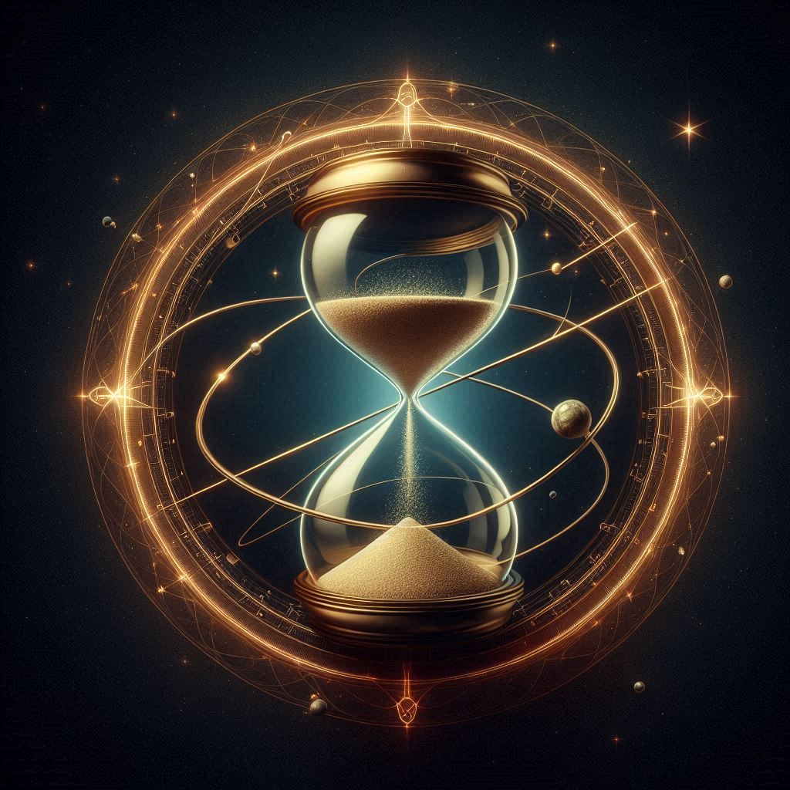

# Shananooah, the Goddess of Time

- **Title**: The Time Weaver
- **Domain**: Time, Continuity, Fate
- **Aspect**: Shananooah is the divine aspect of Raythelion that governs the passage of time. She is the heartbeat of the universe, the silent pulse that ensures the world's unceasing growth and flow.
- **Symbol**: An hourglass with infinite sand surrounded by a celestial orbit, representing the eternal cycle of time.
- **Followers' Epithet**: Shananooah's Chronolites
- **Divine Philosophy**: As the deity of The Rank of Brilliance, Shananooah oversees all deities associated with the passage of time and travel. Her Chronolites understand that time is the soil in which the world plants its seeds of change, and they revere her as the force that nurtures the sprouting of these seeds into reality.

### Origins and Role
Shananooah stands as the divine guardian of time, overseeing the unending march of seconds, minutes, and hours that shape the destiny of the cosmos. She is revered as the weaver of fate, the silent observer who guides the flow of time with unseen hands, ensuring that past, present, and future remain in harmony.

### Divine Attributes
Shananooah's essence resonates with the rhythms and cycles of time, embodying the eternal continuum that binds the fabric of reality together. Her touch influences the flow of events, shaping the course of history and guiding mortals along their destined paths. Shananooah's presence is felt in every heartbeat, every breath, and every moment of existence.

### Symbols and Iconography
The symbol of Shananooah—an hourglass with infinite sand surrounded by a celestial orbit—represents the eternal cycle of time and the unending flow of destiny. It symbolizes the interconnectedness of all moments in time and the ever-present influence of fate on the course of history.

### Followers and Worship
Shananooah's followers, known as Shananooah's Chronolites, are scholars, historians, and timekeepers who devote themselves to the study and understanding of time's mysteries. They view time as a sacred tapestry, woven by Shananooah's hands, and they seek to unravel its secrets and unlock its hidden truths.

### Rituals and Worship
- **The Ceremony of Moments**: A yearly ritual where Chronolites reflect on significant events of the past year and make predictions for the coming one, honoring the continuous thread of time woven by Shananooah.
- **The Hourglass Turn**: A daily practice of meditation where followers symbolically turn an hourglass, contemplating the transient nature of existence and their place within the eternal timeline.

### Influence and Manifestations
Shananooah's influence extends beyond the boundaries of time and space, shaping the destiny of worlds and guiding the actions of mortals. Her touch can be felt in the turning of the seasons, the rise and fall of civilizations, and the moments of joy and sorrow that define the human experience.

### Sacred Texts and Teachings
- **The Chronicon**: A collection of writings that chronicle the history of Aetheria, believed to be inspired by Shananooah herself.
- **The Parables of Time**: Stories and lessons that teach the importance of understanding the cyclical nature of time and the role each individual plays in the grand tapestry of life.

### Legacy and Influence
Shananooah's legacy endures through the tireless efforts of her Chronolites, whose study and reverence for time shape the course of history and guide the actions of mortals. Their pursuit of knowledge and understanding serves as a beacon of hope for those who seek to unravel the mysteries of time and unlock its hidden truths.

## **Prayer to Shananooah, The Time Weaver**

O Shananooah, divine weaver of moments,
Your celestial orbit binds the threads of fate.
In your infinite hourglass, sands of eternity flow,
Marking the pulse of the cosmos in silent grace.

Guide us, Chronolites, through the temporal maze,
Where past and future in your presence unite.
Teach us to cherish each fleeting second,
For in your realm, every instant is alight.

Bless us with foresight, clarity, and vision,
To see beyond the veil of time's mystic shroud.
May we embrace change, the seed of the morrow,
And in your chronicles, may our deeds be proud.

In the Ceremony of Moments, we reflect and foresee,
Honoring the tapestry you so artfully weave.
Through the Hourglass Turn, we seek inner peace,
In the eternal cycle, we believe and conceive.

Shananooah, Goddess of Time, Continuity, and Fate,
We are but stardust in your grand cosmic tale.
With reverence, we walk the path you illuminate,
As Chronolites, in your brilliance, we shall prevail.
