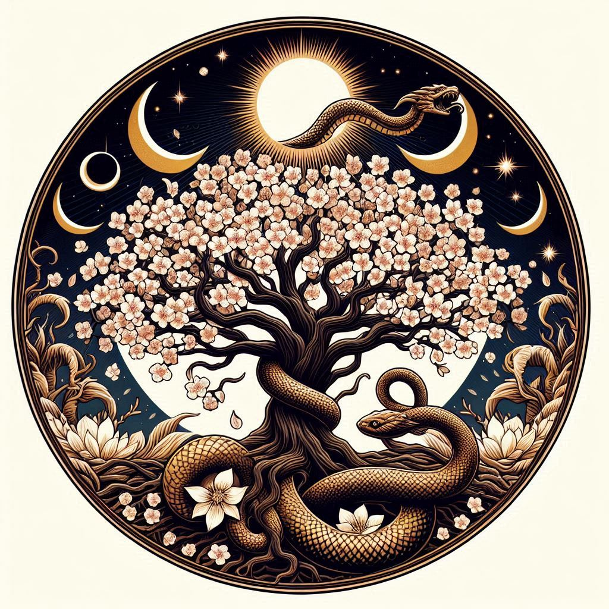

# Verdanth, the Matron of Life

- **Title**: The Greenwarden
- **Domain**: Growth, Renewal, Nature
- **Symbol**: A blooming tree encircled by an ouroboros, symbolizing the eternal cycle of life and nature's perpetual renewal.
- **Followers' Epithet**: Verdanth's Bloom
- **Divine Philosophy**: Verdanth's followers, known as Verdanth's Bloom, are the stewards of the earth. They embrace the cycles of life, understanding that death and rebirth are natural and necessary for the continuation of life. They are often seen as healers, druids, and agriculturists who honor the changing seasons and the nurturing aspect of nature. Verdanth's presence is felt in every new sprout, every healed wound, and in the silent strength of the growing trees.

### Origins and Role
Verdanth stands as the divine embodiment of life and renewal, guiding the cycles of nature with gentle yet unwavering hands. She is revered as the essence of growth and the force behind the eternal renewal of the natural world, nurturing all living beings with her boundless compassion and wisdom.

### Divine Attributes
Verdanth's essence resonates with the vitality and resilience of the natural world. Her touch revitalizes the earth, bringing forth new life from the soil and infusing the world with the energy of growth and renewal. Verdanth's presence embodies the interconnectedness of all living beings, fostering harmony and balance in the delicate dance of life.

### Symbols and Iconography
The symbol of Verdanth—a blooming tree encircled by an ouroboros—epitomizes the cyclical nature of life and the eternal renewal of the natural world. It symbolizes the interconnectedness of all living beings and the perpetual cycle of growth, death, and rebirth that sustains the balance of life on earth.

### Followers and Worship
Verdanth's followers, known as Verdanth's Bloom, are healers, druids, and agriculturists who dedicate themselves to the preservation and nurturing of the natural world. They view nature as a sacred gift, honoring Verdanth's teachings as they seek to live in harmony with the earth and all its inhabitants.

### Rituals and Worship
- **The Greening Rite**: A spring festival celebrating new growth, where seeds are blessed and planted to honor Verdanth's gift of renewal.
- **The Harvest Homage**: An autumnal ceremony giving thanks for the bounty of the harvest, recognizing Verdanth's role in the abundance of nature.

### Influence and Manifestations
Verdanth's influence is felt in the ebb and flow of the seasons, the blossoming of flowers, and the verdant growth of forests. Her divine touch infuses the world with vitality and beauty, nurturing life in all its forms and ensuring the continuation of the natural cycle.

### Sacred Texts and Teachings
- **The Codex of Seasons**: A compilation of teachings and parables illustrating the sacred cycles of growth and decay, life and death, as guided by Verdanth.
- **The Lore of the Land**: Oral traditions passed down through generations, recounting Verdanth's influence on the natural world and the responsibilities of her followers.

### Legacy and Influence
Verdanth's legacy endures through the tireless efforts of her followers, whose stewardship of the earth ensures the continuation of life and the preservation of the natural world. Their reverence for nature and dedication to Verdanth's teachings serve as a beacon of hope for those who seek harmony and balance in a world threatened by imbalance and destruction.

## Prayer to Verdanth, the Matron of Life

Oh, Verdanth, Greenwarden divine,
Whose gentle touch makes the earth entwine,
In your presence, we stand aligned,
With reverence for the life you define.

Grant us strength, in nature's embrace,
To walk the path with steady pace,
With every step, we seek your grace,
In the sacred grove, in every space.

Guide our hands, as we tend the land,
With care and love, as you command,
In every seed, in every strand,
Let your presence forever stand.

Verdanth, Matron of Life's embrace,
In your name, we find solace and grace,
With every breath, with every trace,
May we honor your eternal place.

Amen.
